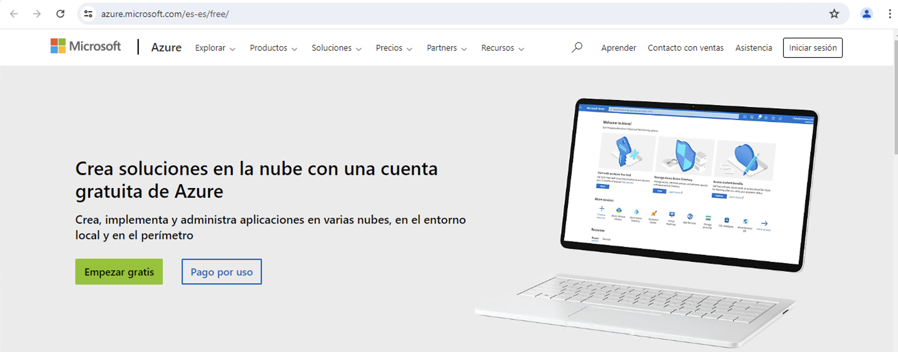
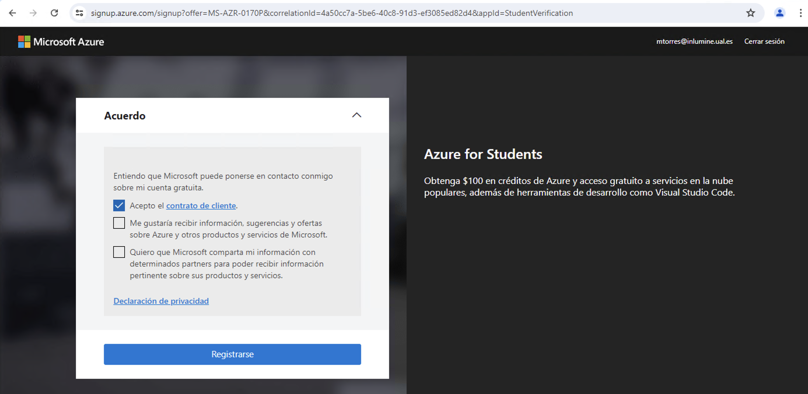
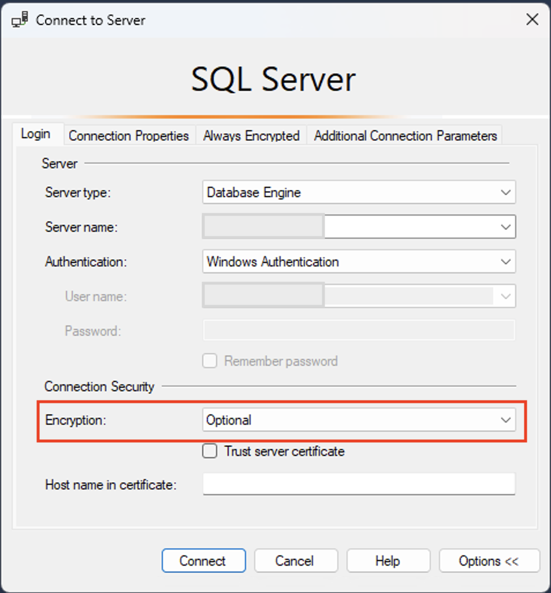

////
NO CAMBIAR!!
Codificación, idioma, tabla de contenidos, tipo de documento
////
:encoding: utf-8
:lang: es
:toc: right
:toc-title: Tabla de contenidos
:doctype: book
:linkattrs:
:icons: font
:chapter-signifier: Capítulo

////
Nombre y título del trabajo
////
# Configuración del entorno de la asignatura - Almacenes de datos
Almacenes de datos - Grado en Ingeniería Informática - UAL
Manuel Torres <mtorres@ual.es>

image::images/di.png[]

// NO CAMBIAR!! (Entrar en modo no numerado de apartados)
:numbered!: 

[abstract]
== Resumen
////
COLOCA A CONTINUACION EL RESUMEN
////
En este documento se describe el proceso de configuración del entorno de desarrollo para la asignatura de Almacenes de datos del Grado en Ingeniería Informática de la Universidad de Almería. Se detallan los pasos necesarios para instalar SQL Server y SQL Server Data Tools (SSDT) en el entorno de desarrollo, así como las extensiones de Analysis Services, Integration Services y Reporting Services para Visual Studio. Además, se explica cómo solicitar una suscripción gratuita de Azure para estudiantes y cómo acceder a los servicios académicos de Azure.

////
COLOCA A CONTINUACION LOS OBJETIVOS
////
.Objetivos
* Solicitar una suscripción gratuita de Azure para estudiantes.
* Acceder a los servicios académicos de Azure.
* Instalar SQL Server y SQL Server Data Tools (SSDT) en el entorno de desarrollo.
* Descargar e instalar las extensiones de Analysis Services, Integration Services y Reporting Services para Visual Studio.

## Suscripción a Azure para estudiantes

Microsoft Azure ofrece una suscripción gratuita para estudiantes. La suscripción es de uso personal, tiene una duración de un año y un saldo de 100 USD. Este saldo se puede utilizar para consumir los servicios de Azure, como máquinas virtuales, bases de datos, almacenamiento, etc. Si se supera el saldo de 100 USD, los servicios se desactivarán automáticamente y no se realizarán cargos adicionales. Para evitar la interrupción de los servicios, se puede cambiar a una suscripción de pago en cualquier momento. **Sin embargo, no se recomienda cambiar a una suscripción de pago en el entorno de desarrollo de la asignatura. Es responsabilidad de los estudiantes gestionar adecuadamente el saldo de la suscripción gratuita para evitar cargos adicionales.**

A continuación se detallan los pasos necesarios para solicitar una suscripción gratuita de Azure para estudiantes:

. Iniciar sesión en https://portal.azure.com[Portal de Azure] con las credenciales de la cuenta de estudiante. Aparecerá el panel de inicio de Azure. Si es la primera vez que se accede a Azure, se mostrará un mensaje de bienvenida y se indicará que hay que crear una suscripción. Empezaremos accediendo a la suscripción gratuita de Azure para estudiantes.
+
image::images/azure-inicio.png[Panel de inicio de Azure]
. Solicitar la suscripción gratuita para estudiantes de 100 USD. Esta suscripción permite acceder a todos los servicios de Azure durante un año sin coste alguno. Para ello, se debe hacer clic en el botón "Suscríbase ahora" que aparece en la parte superior de la pantalla.
. Se abrirá una nueva ventana en la que se deberá hacer clic en el botón "Empezar gratis". Aparecerá un formulario que habrá que rellenar con algunos datos personales mínimos.
+

. Aceptar los términos y condiciones de la suscripción gratuita y hacer clic en el botón "Siguiente". Se mostrará un mensaje de confirmación de la suscripción.
+

+
[NOTE]
====
Para aumentar la seguridad de la cuenta de Azure, se recomienda habilitar la autenticación de dos factores. Para ello, se debe hacer clic en el icono de la cuenta de usuario que aparece en la parte superior derecha de la pantalla y seleccionar la opción "Configuración de la cuenta". En la sección "Seguridad", se debe hacer clic en el enlace "Configurar autenticación de dos factores" y seguir las instrucciones que se muestran en pantalla.
====
. Una vez completado el proceso de suscripción, se accederá al panel de inicio de servicios académicos de Azure. La pestaña de "Información general" mostrará un resumen de la suscripción, incluyendo el saldo disponible y la fecha de caducidad de la suscripción.
+
image::images/azure-suscripcion-iniciada.png[Panel de inicio de Azure con suscripción activa]

[NOTE]
====
Para acceder a los servicios académicos de Azure, basta con introducir el término "Education" en el cuadro de búsqueda de recursos, servicios y documentos de Azure. Aparecerá un listado de servicios y recursos académicos disponibles para su uso.
====

## Descarga e instalación de SQL Server

En esta asignatura se utilizará SQL Server como sistema de gestión de bases de datos. Para instalar SQL Server en el entorno de desarrollo, se debe seguir el siguiente procedimiento:

. En el Portal de Azure, acceder a los servicios académicos introduciendo el término "Education" en el buscador de recursos, servicios y documentos de Azure.
. Desplegar el menú de Recursos de aprendizaje de la izquierda y seleccionar la opción "Software". Aparecerá un listado de software disponible para su descarga. Ese listado se puede filtrar introduciendo "SQL Server" en el cuadro de búsqueda. Aparecerá un listado como el de la figura. Descargar la versión de SQL Server que se desee instalar en el entorno de desarrollo. En nuestro caso, descargaremos la versión 2019 de 64 bits en español.
+
image::images/sql-server-listado.png[Descarga de SQL Server en Azure]
. Una vez descargado el instalador de SQL Server, ejecutarlo y seguir las instrucciones del asistente de instalación. Seleccionar la opción "Nueva instalación independiente de SQL Server", tal y como se muestra en la figura. Esto instalará una nueva instancia de SQL Server en el equipo.
+
image::images/sql-server-instalacion.png[Asistente de instalación de SQL Server]
. En el instalador dejar las opciones predeterminadas salvo en lo siguiente:
+
* En el paso de "Selección de características", seleccionar todo y anular la selección de los componentes asociados a características de Machine Learning. Esto se debe a que requiere una configuración inicial adicional que no es necesaria para el desarrollo de esta asignatura.
* En el paso de "Configuración del motor de base de datos" dejar "Modo de autenticación de Windows como opción predeterminada." *En esa misma pestaña, desplazar la barra de scroll hacia abajo y añadir el usuario actual al grupo de administradores de SQL Server.*
* En el paso de "Configuración de la instancia" seleccionar "Modo multidimensional y de minería de datos" y agregar el usuario actual como administrador de la instancia.
* En el paso "Distributed Replay Controller" añadir al usuario actual como administrador de la instancia.

## Descarga y configuración de SQL Server Data Tools

SQL Server Data Tools (SSDT) es una herramienta que se utiliza para desarrollar bases de datos y soluciones de Business Intelligence en SQL Server. Para instalar SSDT en el entorno de desarrollo, se debe seguir el siguiente procedimiento:

[IMPORTANT]
====
En los distintos pasos de este procedimiento, visitaremos en varias ocasiones la página web de descarga de SSDT para Visual Studio. Es muy importante seleccionar siempre en el menú de la izquierda la versión de SQL Server que se ha instalado en el entorno de desarrollo para que las extensiones de SSDT sean compatibles con esa versión de SQL Server. En nuestro caso, seleccionaremos la versión 2019.
====

. Desde el instalador de SQL Server, seleccionar la opción "Instalación de SQL Server Data Tools". 
+
image::images/ssdt-instalacion.png[Instalación de SQL Server Data Tools]
. Se abrirá la página web de https://learn.microsoft.com/es-es/sql/ssdt/download-sql-server-data-tools-ssdt?view=sql-server-ver15[Instalación de SSDT para Visual Studio]. En esta página se encuentra tanto el enlace de descarga de SSDT para Visual Studio como el de las extensiones para Analysis Services, Integration Services y Reporting Services.
.. Descargar e instalar SSDT con Visual Studio desde el https://learn.microsoft.com/es-es/sql/ssdt/download-sql-server-data-tools-ssdt?view=sql-server-ver15#install-ssdt-with-visual-studio[enlace proporcionado en la página web]. En el instalador se puede elegir la opción de añadir algunas extensiones adicionales, ya sea de forma individual o como grupos de componentes. A esta instalación de grupos de componentes se le llama "Carga de trabajo". En nuestro caso, seleccionaremos la carga de trabajo "Almacenamiento y procesamiento de datos" para instalar las extensiones de SQL Server, Azure Data Lake y Hadoop.
+
image::images/ssdt-carga-trabajo.png[Selección de carga de trabajo en la instalación de SSDT]
.. Después de instalar SSDT, abrir Visual Studio y realizar una modificación de configuración para que añadir el inglés como idioma de desarrollo. Para ello, ir a "Herramientas" -> "Obtener herramientas y características" y seleccionar la pestaña "Paquetes de idioma". Añadir "English" a la lista de idiomas y hacer clic en "Instalar". Una vez instalado el paquete de idioma, nos pide reiniciar el ordenador para que los cambios surtan efecto.

## Descarga e instalación de las extensiones de Analysis Services e Integration Services para Visual Studio

Las extensiones de Analysis Services e Integration Services para Visual Studio permiten trabajar con cubos OLAP y paquetes ETL. Para instalar estas extensiones en el entorno de desarrollo, se debe seguir el siguiente procedimiento.

### Descarga de las extensiones de Analysis Services e Integration Services

Desde el instalador de SQL Server, seleccionar la opción de "Instalación de SQL Server Data Tools" para poder ir a la página web de https://learn.microsoft.com/es-es/sql/ssdt/download-sql-server-data-tools-ssdt?view=sql-server-ver15[Instalación de SSDT para Visual Studio]. En esta página se encuentra el https://learn.microsoft.com/es-es/sql/ssdt/download-sql-server-data-tools-ssdt?view=sql-server-ver15#install-extensions-for-analysis-services-integration-services-and-reporting-services[enlace de descarga de las extensiones de Analysis Services para Visual Studio]. Descargar las extensiones de Analysis Services e Integration Services para Visual Studio. 

### Instalación de las extensiones de Analysis Services e Integration Services

Antes de instalar las extensiones de Analysis Services e Integration Services es importante asegurarse que Visual Studio esté cerrado así como cualquier instalador (p.e. el instalador de SQL Server). 

Para instalar cada extensión basta con ejecutar el instalador descargado y seguir las instrucciones del asistente de instalación.

Una vez instaladas las extensiones, abrir Visual Studio y comprobar que las extensiones de Analysis Services e Integration Services están disponibles en la lista de plantillas de proyectos.

image::images/ssdt-extensiones-instaladas.png[Extensiones de Analysis Services e Integration Services en Visual Studio]

## Descarga e instalación de SQL Server Management Studio

SQL Server Management Studio (SSMS) es una herramienta que se utiliza para administrar y configurar instancias de SQL Server. También se puede usar para crear y administrar bases de datos, tablas, procedimientos almacenados, etc. Para instalar SSMS en el entorno de desarrollo, basta con descargar el instalador de SQL Server Management Studio desde la página web de https://docs.microsoft.com/es-es/sql/ssms/download-sql-server-management-studio-ssms[Descarga de SQL Server Management Studio] y seguir las instrucciones del asistente de instalación.

Tras la instalación, abrir SQL Server Management Studio y conectarse a la instancia de SQL Server que se ha instalado en el entorno de desarrollo. Aparecerá el nombre de la instancia en el campo "Nombre del servidor". Seleccionaremos el modo de autenticación Windows. En la configuración de seguridad de la conexión, seleccionaremos "Opcional" ya que no tenemos configurado el certificado de seguridad. Finalmente, pulsaremos "Conectar" para establecer la conexión con la instancia de SQL Server.

## Instalación de ejemplos

Para ilustrar los conceptos teóricos de la asignatura, se proporcionarán ejemplos de bases de datos y cubos OLAP que se podrán descargar e instalar en el entorno de desarrollo. Estos ejemplos se utilizarán en las prácticas de la asignatura para realizar ejercicios de modelado de datos, creación de cubos OLAP y desarrollo de paquetes ETL. A continuación se muestra una lista de ejemplos disponibles:

### AdventureWorksDW2019

AdventureWorksDW2019 es una base de datos de ejemplo que contiene datos de ventas, productos, clientes, etc. Se puede utilizar para realizar ejercicios de modelado de datos y creación de cubos OLAP. A continuación se detallan los pasos necesarios para descargar e instalar la base de datos AdventureWorksDW2019:

. Descargar una https://github.com/Microsoft/sql-server-samples/releases/tag/adventureworks[copia de seguridad de base de datos AdventureWorksDW2019 desde GitHub]. Descargar el archivo https://github.com/Microsoft/sql-server-samples/releases/download/adventureworks/AdventureWorksDW2019.bak[`AdventureWorksDW2019.bak`] y guardarlo en una ubicación local.
. Copiar el archivo de copia de seguridad anterior en el directorio de copia de seguridad de la instancia local del motor de base de datos de SQL Server. Por defecto, este directorio se encuentra en la ruta `C:\Program Files\Microsoft SQL Server\MSSQL15.MSSQLSERVER\MSSQL\Backup`.
. Iniciar SQL Server Management Studio y conectarse a la instancia del motor de base de datos.
. Restaurar la base de datos desde el archivo de copia de seguridad. Para ello, hacer clic con el botón derecho en "Bases de datos" y seleccionar la opción "Restaurar base de datos". Seleccionar la opción "Dispositivo" y buscar el archivo de copia de seguridad en el directorio de copia de seguridad. Hacer clic en "Aceptar" para iniciar la restauración de la base de datos.

### AdventureWorks2019

AdventureWorks2019 es una base de datos de ejemplo que contiene datos transaccionales de ventas, productos, clientes, etc. Lo utilizaremos para realizar algunas consultas SQL. Los pasos necesarios para su instalación son similares a los del ejemplo anterior. En este caso, se descarga el archivo https://github.com/Microsoft/sql-server-samples/releases/download/adventureworks/AdventureWorks2019.bak[`AdventureWorks2019.bak`].

## Descarga e instalación de Power BI Desktop

Power BI Desktop es una herramienta de análisis de datos que se utiliza para crear informes y visualizaciones interactivas. Para instalar Power BI Desktop en el entorno de desarrollo, basta con descargar el instalador de Power BI Desktop desde la página web de https://www.microsoft.com/es-es/power-platform/products/power-bi/desktop[Descarga de Power BI Desktop] y seguir las instrucciones del asistente de instalación.

Tras la instalación, al iniciar Power BI Desktop pedirá que se inicie sesión con una cuenta de Microsoft. Se puede utilizar la cuenta de estudiante de Azure para acceder a Power BI Desktop. Una vez iniciada la sesión, nos informará que se nos ha asignado una licencia de Power BI de forma gratuita. Aceptar la licencia y se podrá empezar a crear informes y visualizaciones con los datos de las bases de datos y cubos OLAP que se hayan desarrollado en el entorno de desarrollo.
