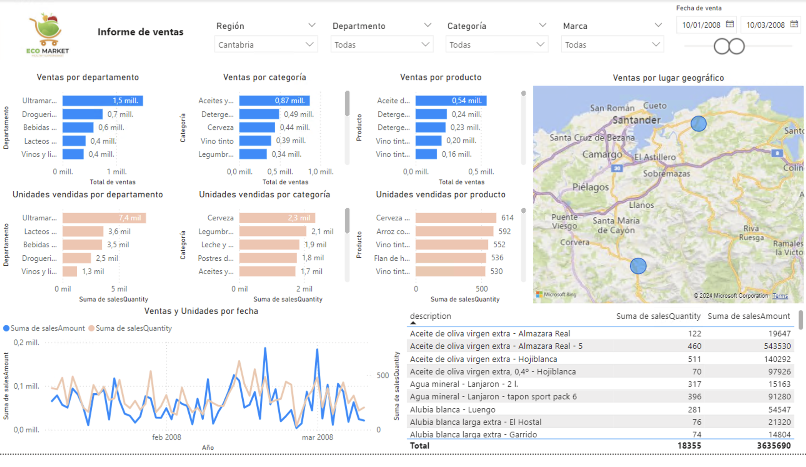
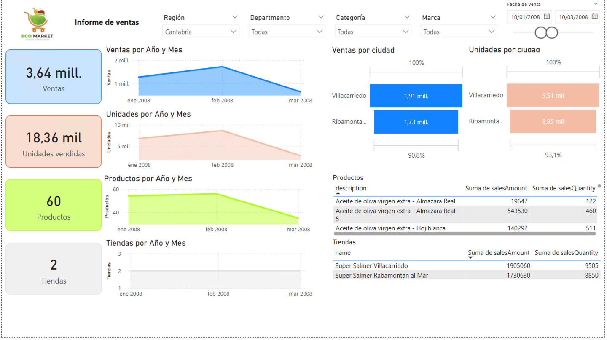
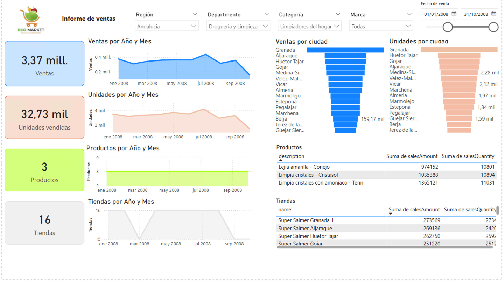
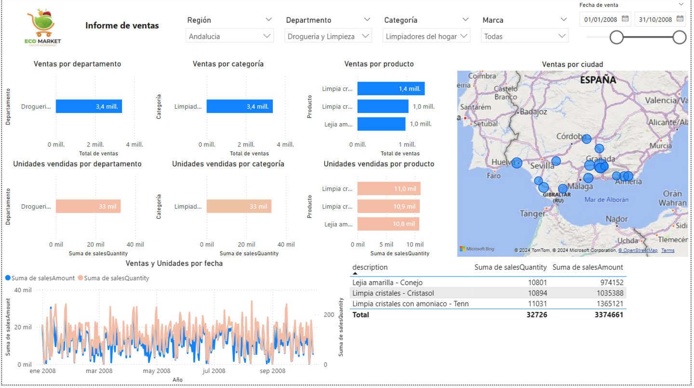
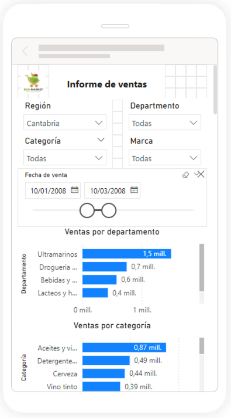
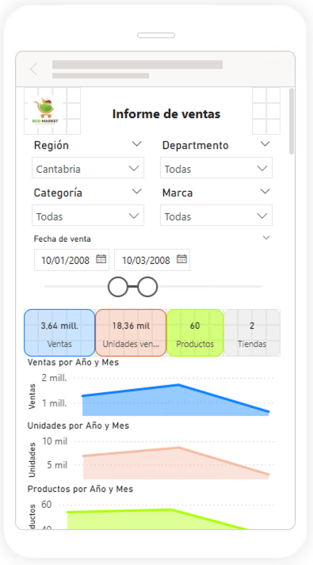

////
NO CAMBIAR!!
Codificación, idioma, tabla de contenidos, tipo de documento
////
:encoding: utf-8
:lang: es
:toc: right
:toc-title: Tabla de contenidos
:doctype: book
:linkattrs:
:icons: font

////
Nombre y título del trabajo
////
# Creación de un dashboard con Power BI - Almacenes de datos
Grado en Ingeniería Informática. Universidad de Almería
Manuel Torres <mtorres@ual.es>

image::../../../images/di.png[]

// NO CAMBIAR!! (Entrar en modo no numerado de apartados)
:numbered!: 

## Resumen

En esta actividad se va a realizar un informe con Power BI a partir de una base de datos de ejemplo de ventas en una cadena de supermercados. El informe estará formado por dos páginas que mostrarán información variada sobre ventas. Se incluirán segmentadores para filtrar por distintos campos. Se probarán distintos tipos de gráficos y se usará la funcionalidad de sincronización de segmentadores entre páginas. Además se creará una vista móvil y finalmente se publicará en Power BI Service.

.Objetivos
* Crear un informe con Power BI a partir de una base de datos de ejemplo.
* Crear distintos tipos de gráficos y tablas de datos.
* Usar segmentadores para filtrar la información.
* Sincronizar segmentadores entre páginas.
* Crear una vista móvil.
* Publicar el informe en Power BI Service.

:numbered:

## Descripción de la actividad

Clonar el https://github.com/ualmtorres/SampleDatabases.git[repositorio SampleDatabases de GitHub]. La carpeta `Tienda` contiene una serie de archivos en formato CSV de una base de datos de ejemplo de ventas en una cadena de supermercados.

1. Crear un proyecto Power BI con el nombre `Tienda`.
2. Obtener datos a partir de las tablas siguientes:
    * `Cuando.csv`: Tabla Cuando.
    * `Donde.csv`: Tabla Donde.
    * `Que.csv`: Tabla Que.
    * `Venta.csv`: Tabla Venta.
3. Crear las relaciones en la Vista de modelo para que las tablas `Cuando`, `Donde` y `Que` estén relacionadas con la tabla `Venta`.

El informe estará formado por dos páginas, que se describen a continuación.

### Creación de la página 1 del informe

Crear los objetos siguientes (usar la figura siguiente como referencia):

1. Crear un gráfico de barras que muestre el total de ventas por departamento. Usar un color azul para las barras. Añadir etiquetas de datos. El gráfico tendrá como título Ventas por departamento.
+
[TIP]
====
Para una mejor presentación, se pueden cambiar los títulos de los ejes para que en lugar de ser automáticos y muestren el nombre de los campos, muestren valores personalizados, como `Departamento` y `Total de ventas`.
====
2. Crear una copia a la derecha que muestre el total de ventas por categoría. El gráfico tendrá como título Ventas por categoría.
3. Crear una copia a la derecha que muestre el total de ventas por producto (usar la descripción del producto). El gráfico tendrá como título Ventas por producto.
4. Debajo de los gráficos anteriores crear 3 gráficos de barras copiados de los anteriores que muestren las unidades vendidas por departamento, las unidades vendidas por categoría y las unidades vendidas por producto. Usar un color anaranjado para las barras. Los gráficos tendrán como título Unidades vendidas por departamento, Unidades vendidas por categoría y Unidades vendidas por producto, respectivamente.
5. Crear a la derecha un gráfico de mapa que muestre las ventas por ciudad (`town`). El tamaño de la burbuja será proporcional al total de ventas. Se añadirá a la información sobre herramientas la suma de las unidades ventidas. El gráfico tendrá como título Ventas por lugar geográfico.
6. En la parte inferior izquierda crear un gráfico de líneas que muestre las ventas y las unidades por fecha. Las ventas se representarán en el Eje Y izquierdo y las unidades en el Eje Y derecho (secundario) El gráfico tendrá como título Ventas y Unidades por fecha. Modificar las propiedades del gráfico en la pestaña `Objeto visual`, opción `Líneas` para que la serie de unidades vendidas sea de color anaranjado y se mantenga la coherecia de colores entre los gráficos.
7. En la parte inferior derecha crear una tabla de datos que muestre el producto (descripción), el total de ventas y el total de unidades vendidas. La tabla no tendrá título.
8. Añadir en la parte superior segmentadores en formato de lista desplegable para filtrar por región, departamento, categoría y marca. Añadir también un segmentador de rango para filtrar por fecha de venta. Modificar los títulos de los segmentadores para que sean Región, Departamento, Categoría, Marca y Fecha de venta, respectivamente.
9. Añadir en la parte superior izquierda un logo ficticio de la empresa y un cuadro de texto con `Informe de ventas`.

La figura siguiete muestra un ejemplo de la página 1 del informe seleccionando las ventas de la Región `Cantabria`, y `Fecha de venta` entre `10/01/2008` y `10/03/2008`.

### Creación de la página 2 del informe

Las dos páginas del informe compartirán los segmentadores de la parte superior, así como el logo y el cuadro de texto. Para ello, basta con seleccionar los objetos a compartir y copiarlos en la página 2. Aparecerá un mensaje en un cuadro de diálogo preguntando si se desean mantener sincronizados los valores de los segmentadores. Seleccionar la opción `Sincronizar`. Esto permitirá que al cambiar los valores de los segmentadores en una página, se reflejen en la otra.

[NOTE]
====
La configuración de sincronización de segmentadores también se puede realizar seleccionando el segmentador y en el menú `Ver` en la opción `Sincronización de segmentadores` se indica las páginas en las que se desea que se sincronicen los valores. Además se indica si el segmentador es visible en la página.
====

Además de los objetos compartidos, la página 2 del informe estará formada por los objetos siguientes (usar la figura siguiente como referencia):

1. Cuatro gráficos de tarjeta en una columna a la izquierda que muestren el total de ventas, el total de unidades vendidas, el total de productos diferentes vendidos y el total de tiendas diferentes en las que se han registrado ventas. Cambiaremos los textos que se muestran en las tarjetas a estos valores respectivamente: `Ventas`, `Unidades`, `Productos` y `Tiendas`. El color de fondo de las tarjetas será celeste, anaranjado, verde y gris, respectivamente. En la tarjeta de ventas y unidades fijaremos el número de decimales a 2.
2. A la derecha de los gráficos de tarjeta, crear cuatro gráficos de áreas que muestren por año y mes el total de ventas, unidades vendidas, productos diferentes vendidos y tiendas diferentes en las que se han registrado ventas. Basta con crear un gráfico y copiarlo tres veces. Los gráficos tendrán como título Ventas por año y mes, Unidades por año y mes, Productos por año y mes y Tiendas por año y mes, respectivamente. Para mejorar la presentación de los gráficos, es recomendable cambiar el título del Eje Y para que muestre `Ventas`, `Unidades`, `Productos` y `Tiendas`, respectivamente, en lugar de los nombres de los campos.
+
[TIP]
====
Para mostrar en el Eje X sólo el año y el mes, basta con eliminar los campos no necesarios en la zona de datos del Eje X.
====
3. Añadir en la parte superior derecha dos gráficos de embudo que muestren el total de ventas por ciudad y las unidades vendidas por ciudad. Ambis gráficos usarán dos decimales en las series de datos. Los gráficos tendrán como título `Ventas por ciudad` y `Unidades por ciudad`, respectivamente. Añadir también etiquetas de datos. Además, respetar la coherencia de colores entre los gráficos (usar azul para ventas y anaranjado para unidades).
4. Añadir en la parte inferior derecha dos tablas de datos. La primera tabla mostrará el total de ventas y unidades vendidas por producto (descripción) y estará a la misma altura que la tarjeta y el gráfico de productos vendidos que tiene a su izquierda. La segunda tabla mostrará el total de ventas y unidades vendidas por tienda y estará a la misma altura que la tarjeta y el gráfico de tiendas que tiene a su izquierda. El título de las tablas será `Productos` y `Tiendas`, respectivamente. Cambiar en ambas tablas los títulos de las columnas para que muestren `Producto`, `Ventas` y `Unidades` en la primera tabla y `Tienda`, `Ventas` y `Unidades` en la segunda tabla.

La figura siguiente muestra un ejemplo de la página 2 del informe manteniendo la selección de las ventas de la Región `Cantabria`, y `Fecha de venta` entre `10/01/2008` y `10/03/2008`.

Si ahora cambiamos los valores de los segmentadores de la página 2 a la región `Andalucía`, departamento `Droguería y Limpieza`, categoría `Limpiadores del hogar` y la fecha entre `01/01/2008` y `31/10/2008`, el informe se verá como en la figura siguiente.

Si ahora cambiamos a la pestaña 1, el informe se verá como en la figura siguiente, habiendo cambiado los valores de los segmentadores a la región `Andalucía`, departamento `Droguería y Limpieza`, categoría `Limpiadores del hogar` y la fecha entre `01/01/2008` y `31/10/2008`.

## Actividades complementarias

Una vez realizado el informe, se pueden realizar las siguientes actividades complementarias:

1. Crear la vista de informe en formato de teléfono móvil.
2. Publicar el informe en Power BI Service.

Para la vista en formato móvil incluiremos lo siguiente:

1. En la página 1, no incluir el gráfico de líneas y la tabla de datos. La disposición de elementos es libre. No obstante, se muestra una propuesta:
a. Logo y cuadro de texto.
b. Segmentadores región y departamento.
c. Segmentadores categoría y marca.
d. Segmentador fecha de venta.
e. Gráfico de barras de ventas por departamento.
f. Gráfico de barras de ventas por categoría.
g. Gráfico de barras de ventas por producto.
h. Gráfico de barras de unidades vendidas por departamento.
i. Gráfico de barras de unidades vendidas por categoría.
j. Gráfico de barras de unidades vendidas por producto.
k. Gráfico de mapa de ventas por ciudad.
2. En la página 2, no incluir las tablas de datos. La disposición de elementos es libre. No obstante, se muestra una propuesta:
a. Logo y cuadro de texto.
b. Segmentadores región y departamento.
c. Segmentadores categoría y marca.
d. Segmentador fecha de venta.
e. Gráficos de tarjeta de ventas, unidades, productos y tiendas.
f. Gráfico de áreas de ventas por año y mes.
g. Gráfico de áreas de unidades por año y mes.
h. Gráfico de áreas de productos por año y mes.
i. Gráfico de áreas de tiendas por año y mes.
j. Gráficos de embudo de ventas por ciudad y unidades por ciudad.

A continuación se muestra un ejemplo de la vista en formato móvil de la página 1 del informe con la región `Cantabria`, y `Fecha de venta` entre `10/01/2008` y `10/03/2008`.

A continuación se muestra un ejemplo de la vista en formato móvil de la página 2 del informe con manteniendo los valores de los segmentadores con la región `Cantabria`, y `Fecha de venta` entre `10/01/2008` y `10/03/2008`.

## Conclusiones

En esta actividad se ha creado un informe con Power BI a partir de una base de datos de ejemplo de ventas en una cadena de supermercados. Se han creado distintos tipos de gráficos y tablas de datos, se han usado segmentadores para filtrar la información y se ha sincronizado los segmentadores entre páginas. Se ha creado una vista móvil y finalmente se ha publicado en Power BI Service.