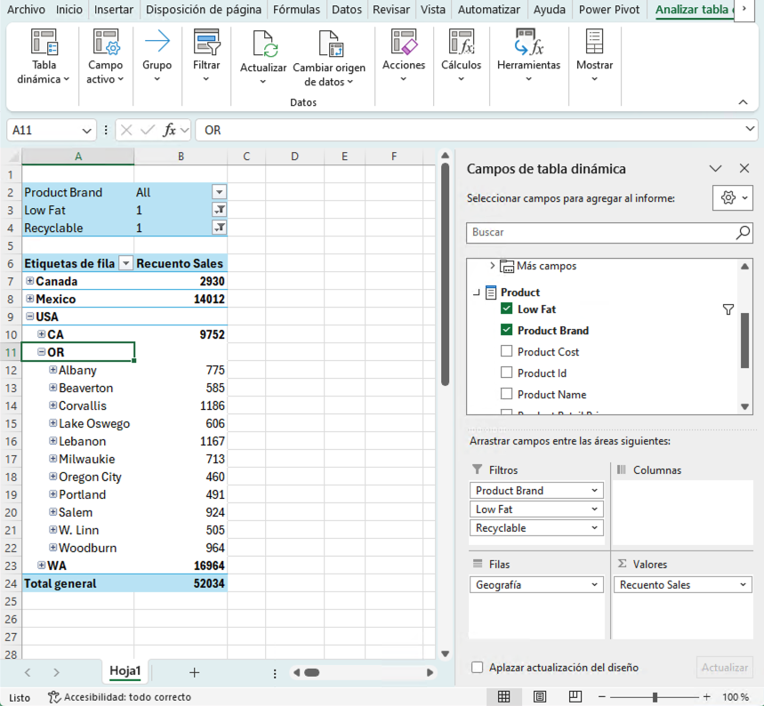
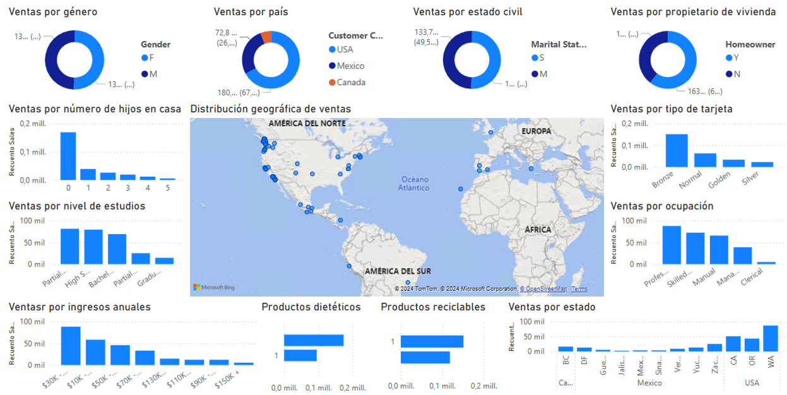

////
NO CAMBIAR!!
Codificación, idioma, tabla de contenidos, tipo de documento
////
:encoding: utf-8
:lang: es
:toc: right
:toc-title: Tabla de contenidos
:doctype: book
:linkattrs:
:icons: font

////
Nombre y título del trabajo
////
# Creación de cubos con Microsoft Analysis Services - Almacenes de datos
Grado en Ingeniería Informática. Universidad de Almería
Manuel Torres <mtorres@ual.es>

image::../../../images/di.png[]

// NO CAMBIAR!! (Entrar en modo no numerado de apartados)
:numbered!: 

## Resumen

En esta actividad se va a crear un cubo OLAP con Microsoft Analysis Services a partir de una base de datos de ejemplo de ventas en una cadena de supermercados. Se importarán las tablas de la base de datos de ejemplo, se crearán las dimensiones y el cubo, y se definirán jerarquías en las dimensiones. Se procesarán las dimensiones y el cubo para desplegarlo en el servidor de Analysis Services y se realizará una prueba en el explorador de cubos de SQL Server Management Studio para comprobar que el cubo se ha creado correctamente. Además, se plantearán actividades complementarias para explorar el cubo mediante una tabla dinámica en Excel y un informe en Power BI.

.Objetivos

* Crear una base de datos en SQL Server con la información de ventas de una cadena de supermercados desde archivos CSV.
* Crear un cubo OLAP con Microsoft Analysis Services a partir de una base de datos de ejemplo de ventas en una cadena de supermercados.
* Definir jerarquías y las relaciones entre sus niveles.
* Procesar las dimensiones y el cubo para desplegarlo en el servidor de Analysis Services.
* Usar el explorador de cubos de SQL Server Management Studio para consultar el cubo.
* Explorar el cubo mediante tablas dinámicas en Excel e informes en Power BI.

:numbered:

## Descripción de la actividad

Clonar el https://github.com/ualmtorres/SampleDatabases.git[repositorio SampleDatabases de GitHub]. La carpeta `FoodMart` contiene una serie de archivos en formato CSV de una base de datos de ejemplo de ventas en una cadena de supermercados.

1. Crear una base de datos en SQL Server con el nombre `FoodMart2000`. **No dejar a ilimitado el crecimiento del archivo de logs**.
2. Importar las tablas siguientes desde el menú `Tasks > Import Data` de SQL Server Management Studio. La primera fila tiene los nombres de las columnas. El formato de la fuenta de datos será el de archivo de texto plano y con extensión CSV. El destino será la base de datos SQL Server `FoodMart2000` creada en el paso anterior mediante la opción `SQL Server Native Client 11.0`.
    * `calendar.csv` (730 filas): Tabla Calendar.
    * `customer.csv` (10.281 filas): Tabla Customer.
    * `product.csv` (1.560 filas): Tabla Product.
    * `region.csv` (109 filas): Tabla Region.
    * `sales-1997.csv` (86.837 filas): Tabla Sales-1997.
    * `sales-1998.csv` (182.883 filas): Tabla Sales-1998.
    * `store.csv` (24 filas): Tabla Store.
3. Crear un proyecto nuevo de SQL Server Analysis Services con el nombre `FoodMart2000` usando la plantilla `Proyecto multidimensional de Analysis Services`.
4. Crear un origen de datos con el nombre `FoodMart2000` que apunte a la base de datos `FoodMart2000`. El origen de datos definirá una conexión nueva a la base de datos `FoodMart2000` de SQL Server y lo hará mediante la autenticación de Windows. En la información de suplantación (`Impersonation Information`), seleccionar la opción `Utilizar un nombre de usuario y una contraseña de Windows específicos` y proporcionar las credenciales de acceso al equipo. 
5. Crear una Vista de origen de datos denominada FoodMart2000 para el Origen de datos creado en el paso anterior agregando las tablas siguientes:
    * `Calendar`
    * `Customer`
    * `Product`
    * `Region`
    * `Sales-1997`
    * `Sales-1998`
    * `Store`
6. Modificar la vista de datos para crear una consulta con nombre denominada `Sales` que realice la unión de las tablas `Sales-1997` y `Sales-1998`. La unión deberá realizarse haciendo `SELECT` con el nombre de las columnas y no con `*`. Una vez creada la consulta con nombre, se pueden eliminar las tablas `Sales-1997` y `Sales-1998` de la vista de datos.
7. Modificar la vista de datos para crear las relaciones entre la tabla de hechos `Sales` y las tablas de dimensión `Calendar`, `Customer`, `Product` y `Store`. Las relaciones se establecerán entre las columnas que tengan el mismo nombre en las tablas de hechos y en las tablas de dimensiones. Para la relación entre `Sales` y `Calendar`, se deberá establecer la relación entre `Sales.transaction_date` y `Calendar.date`.
Establecer también la relación entre `Store` y `Region` a través de la columna `region_id`. Si al crear las relaciones pide convertir la columna de destino (de la dimensión) a una clave principal, aceptar la conversión.
8. Crear un cubo con el nombre `FoodMart2000` que contenga la tabla de hechos `Sales` y las dimensiones `Calendar`, `Customer`, `Product` y `Store`. El cubo deberá contener la medida de recuento de unidades vendidas.
9. Modificar el diseño de las dimensiones para que incluyan todos los atributos disponibles en las tablas de origen.
10. Modificar el diseño de la dimensión `Customer` para definir una jerarquía denominada `Geografía` con los niveles `Country` > `State Province` > `City` > `Customer` de arriba a abajo. Establecer también la relación entre atributos de la jerarquía.
+
[CAUTION]
====
La tabla `Customer` tiene valores en la columna `city` que pueden corresponder a dos valores diferentes en la columna `state_province`. Por ejemplo, `Richmond` puede corresponder a `British Columbia`  en `Canada` o a `California` en `USA`. Hay que solucionar este problema antes de definir la jerarquía. Ver https://www.youtube.com/watch?v=lBYfKOwyvNQ[video para resolución de problemas de claves duplicadas en dimensiones].
====
11. Modificar el diseño de la dimensión `Store` para definir una jerarquía denominda `Geografía` con los niveles `Country` > `State` > `City` > `Store` de arriba a abajo. Establecer también la relación entre atributos de la jerarquía.
12. Procesar las dimensiones y el cubo para realizar el despliegue en el servidor de Analysis Services.
13. Realizar una prueba en el explorador de cubos de SQL Server Management Studio para comprobar que el cubo se ha creado correctamente. Por ejemplo, se puede comprobar las ventas por marca y país del cliente (Marca `ADJ` y país `Canadá` tiene un valor de `12`, y la marca `Amigo` en `México`` tiene un valor de `91`).

## Actividades complementarias

Una vez creado el cubo, se pueden realizar las siguientes actividades complementarias:

1. Crear una tabla dinámica en Excel para explorar el cubo
2. Crear un informe en Power BI para explorar el cubo

Para crear la tabla dinámica en excel podemos plantear un ejemplo que muestre en la zona `Filas` la jerarquía `Geografía` de la dimensión `Customer`, en la zona `Filtros` los campos `Brand`, `Low Fat` y `Recyclable` de la dimensión `Product`. En la zona de datos, mostrar la medida de ventas. La tabla dinámica deberá mostrar algo similar a la figura siguiente al seleccionar el valor `1` en `Low Fat` y `Recyclable` en la zona de filtros, y desplegando la jerarquía `Geografía` en la zona de filas mostrando las ciudades del estado de `OR` en `USA`.

Como informe Power BI, la siguiente figura muestra un ejemplo de informe variado que combina gráficos de anillo, de columnas, de barras y de mapa. A continuación se muestran unas breves indicaciones de lo que debe representar cada uno de ellos.

* Gráficos de anillos
    * Ventas por género (`gender`)
    * Ventas por país (jeraquía `Geografía` de la dimensión `Customer` con los niveles `Country` y `City`)
    * Ventas por estado civil (`marital_status`)
    * Ventasr por propietario de vivienda (`homeowner`)
* Gráficos de columnas
    * Ventas por número de hijos en casa (`num children at home`)
    * Ventas por nivel de estudios (`education`)
    * Ventas por tipo de tarjeta de crédito (`member card`)
    * Ventas por ocupación (`occupation`)
    * Ventas por ingresos anuales (`yearly income`)
    * Ventas por estado (jerarquía `Geografía` de la dimensión `Customer` con los niveles `Country` y `State Province`)
* Gráficos de barras
    * Ventas de productos dietéticos (`low fat`)
    * Ventas de productos reciclables (`recyclable`)
* Gráfico de mapa
    * Ventas por ciudad (jerarquía `Geografía` de la dimensión `Customer` con el nivel `City`)

## Conclusiones

En esta actividad se ha creado un cubo OLAP con Microsoft Analysis Services a partir de una base de datos de ejemplo de ventas en una cadena de supermercados. Se han importado las tablas de la base de datos de ejemplo, se han creado las dimensiones y el cubo, y se han definido jerarquías en las dimensiones `Customer` y `Store`. Se han procesado las dimensiones y el cubo para desplegarlo en el servidor de Analysis Services y se ha realizado una prueba en el explorador de cubos de SQL Server Management Studio para comprobar que el cubo se ha creado correctamente. Además, se han planteado actividades complementarias para explorar el cubo mediante una tabla dinámica en Excel y un informe en Power BI.