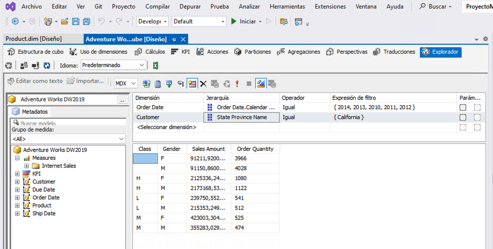
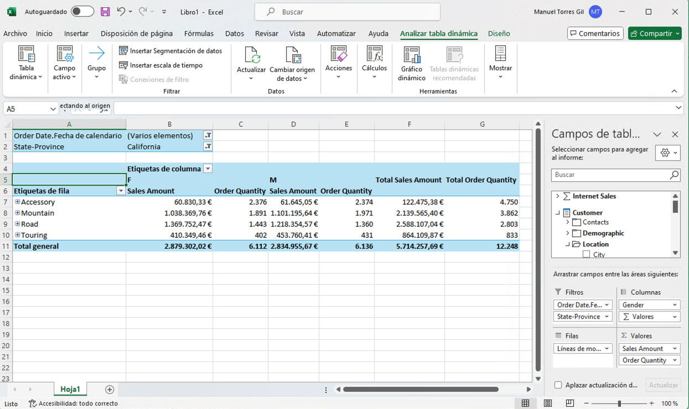

////
NO CAMBIAR!!
Codificación, idioma, tabla de contenidos, tipo de documento
////
:encoding: utf-8
:lang: es
:toc: right
:toc-title: Tabla de contenidos
:doctype: book
:linkattrs:
:icons: font

////
Nombre y título del trabajo
////
# Construcción de cubos OLAP con Microsoft Analysis Services - Almacenes de datos
Grado en Ingeniería Informática. Universidad de Almería
Manuel Torres <mtorres@ual.es>

image::../../../images/di.png[]

// NO CAMBIAR!! (Entrar en modo no numerado de apartados)
:numbered!: 

[abstract]
== Resumen
////
COLOCA A CONTINUACION EL RESUMEN
////
Este tutorial describe cómo usar SQL Server Data Tools para desarrollar e implementar un proyecto de SQL Server Analysis Services, usando la empresa ficticia Adventure Works Cycles para todos los ejemplos. Este tutorial se corresponde con el https://learn.microsoft.com/es-es/analysis-services/multidimensional-tutorial/multidimensional-modeling-adventure-works-tutorial?view=sql-analysis-services-2019[Tutorial oficial de Adventure Works de Modelado multidimensional de Microsoft].
////
COLOCA A CONTINUACION LOS OBJETIVOS
////
.Objetivos
* Crear un proyecto de SQL Server Analysis Services.
* Definir dimensiones y jerarquías.
* Definir un cubo.
* Conocer el proceso de implementación de un proyecto de Analysis Services.
* Modificar medidas, atributos y jerarquías.
* Definir propiedades de dimensiones y de atributos avanzados.
* Definir relaciones entre dimensiones y grupos de medida.
* Definir cálculos.
* Definir indicadores clave de rendimiento (KPI).
* Definir perspectivas y traducciones.

[NOTE]
====
Disponible https://www.youtube.com/playlist?list=PLoS04oY1FHPPUdsBZ97t-vZG0ULTO7ZHb[lista de reproducción en YouTube] con videotutoriales sobre el modelado multidimensional con Microsoft Analysis Services.
====

:numbered:

## Introducción

El modelado multidimensional es una técnica de diseño de bases de datos que se utiliza para analizar datos de negocios. En lugar de utilizar un modelo relacional orientado a transacciones del negocio, el modelado multidimensional utiliza un modelo de estrella o copo de nieve para organizar los datos del negocio en dimensiones y hechos. Las dimensiones son las categorías de datos que se utilizan para analizar los hechos, que son los datos numéricos que se miden. Por ejemplo, en un caso de estudio de ventas, las dimensiones podrían ser la fecha, el producto, la tienda y el cliente, mientras que los hechos podrían ser las ventas y los beneficios. El modelado multidimensional facilita la creación de informes y análisis de datos, ya que los datos se organizan de una manera que refleja la forma en que las personas piensan sobre ellos.

En este tutorial, se mostrará cómo crear un proyecto de SQL Server Analysis Services (SSAS) y cómo definir dimensiones, jerarquías, cubos, medidas, atributos, relaciones y cálculos. También se mostrará cómo implementar un proyecto de Analysis Services y cómo explorar los datos en un cubo implementado. Este tutorial se basa en el https://learn.microsoft.com/es-es/analysis-services/multidimensional-tutorial/multidimensional-modeling-adventure-works-tutorial?view=sql-analysis-services-2019[Tutorial oficial de Adventure Works de Modelado multidimensional de Microsoft].

## Requisitos previos

Para completar este tutorial, necesitarás tener instalado SQL Server Data Tools (SSDT) y SQL Server Management Studio (SSMS). También necesitarás tener instalada la base de datos de ejemplo AdventureWorksDW2019 en tu servidor SQL Server. Toda esta información está disponible en el documento de link:../00-ConfiguracionEntorno/index.html[Configuración del entorno de la asignatura]

## Creación de una solución de Analysis Services para el modelado multidimensional

El escenario de este laboratorio está basado en el https://learn.microsoft.com/es-es/analysis-services/multidimensional-tutorial/analysis-services-tutorial-scenario?view=sql-analysis-services-2019[Tutorial de Analysis Services de Adventure Works de Microsoft]. Se trata de una compañía ficticia llamada Adventure Works Cycles que vende bicicletas y accesorios. La empresa tiene una base de datos de ventas que contiene información sobre los pedidos, los productos, los clientes y las fechas de los pedidos. El objetivo de este laboratorio es crear un cubo multidimensional que permita analizar las ventas de la compañia en distintas situaciones. Para ello, realizaremos las siguientes tareas:

* Creación de un cubo multidimensional en Analysis Services.
* Modificación de medidas, atributos y jerarquías.
* Mejora de la definición de dimensiones y atributos.

[NOTE]
====
De cara al desarrollo del grupo de trabajo de la asignatura, se realizará cada una de estas tareas en una sesión de clase.
====

### Creación de un cubo multidimensional en Analysis Services

En este apartado se describen los pasos necesarios para crear un proyecto de SSAS, definir una vista del origen de datos, definir una dimensión y un cubo, y explorar el cubo implementado.

. https://learn.microsoft.com/es-es/analysis-services/multidimensional-tutorial/lesson-1-defining-a-data-source-view-within-an-analysis-services-project?view=sql-analysis-services-2019[Definir una vista del origen de datos en un proyecto de Analysis Services]
.. https://learn.microsoft.com/es-es/analysis-services/multidimensional-tutorial/lesson-1-1-creating-an-analysis-services-project?view=sql-analysis-services-2019[Crear un proyecto de Analysis Services]
+
[NOTE]
====
A la hora de crear el proyecto en SSAS puede que nos de a elegir entre un proyecto multidimensional o tabular. Para más información, consultar el siguiente enlace: link:./TabularVsMultidimensional.html[Modelos tabulares y multidimensionales en Microsoft Analysis Services]
====

.. https://learn.microsoft.com/es-es/analysis-services/multidimensional-tutorial/lesson-1-2-defining-a-data-source?view=sql-analysis-services-2019[Definir un origen de datos]
+
[NOTE]
====
En el apartado de Información de suplantación (`Impersonation Information`), seleccionar la opción `Utilizar un nombre de usuario y una contraseña de Windows específicos` y proporcionar las credenciales de acceso al equipo. Así fue como configuramos el acceso a SQL Server en la instalación.
====

.. https://learn.microsoft.com/es-es/analysis-services/multidimensional-tutorial/lesson-1-3-defining-a-data-source-view?view=sql-analysis-services-2019[Definir una vista del origen de datos]
.. https://learn.microsoft.com/es-es/analysis-services/multidimensional-tutorial/lesson-1-4-modifying-default-table-names?view=sql-analysis-services-2019[Modificar los nombres de tabla predeterminados]

. https://learn.microsoft.com/es-es/analysis-services/multidimensional-tutorial/lesson-2-defining-and-deploying-a-cube?view=sql-analysis-services-2019[Definir e implementar un cubo]
.. https://learn.microsoft.com/es-es/analysis-services/multidimensional-tutorial/lesson-2-1-defining-a-dimension?view=sql-analysis-services-2019[Definir una dimensión]
.. https://learn.microsoft.com/es-es/analysis-services/multidimensional-tutorial/lesson-2-2-defining-a-cube?view=sql-analysis-services-2019[Definir un cubo]
.. https://learn.microsoft.com/es-es/analysis-services/multidimensional-tutorial/lesson-2-3-adding-attributes-to-dimensions?view=sql-analysis-services-2019[Agregar atributos a dimensiones]
.. https://learn.microsoft.com/es-es/analysis-services/multidimensional-tutorial/lesson-2-4-reviewing-cube-and-dimension-properties?view=sql-analysis-services-2019[Revisar las propiedades de cubo y dimensión]
.. https://learn.microsoft.com/es-es/analysis-services/multidimensional-tutorial/lesson-2-5-deploying-an-analysis-services-project?view=sql-analysis-services-2019[Implementar un proyecto de Analysis Services]
.. https://learn.microsoft.com/es-es/analysis-services/multidimensional-tutorial/lesson-2-6-browsing-the-cube?view=sql-analysis-services-2019[Examinar el cubo]

#### Caso de estudio

Estamos interesados en conocer el comportamiento de las ventas de la empresa Adventure Works Cycles. En concreto, necesitamos saber cuáles han sido las ventas realizadas y las unidades vendidas por clase de producto y género de cliente. Estas ventas se quieren analizar para aquellos pedidos realizados en los años comprendidos entre 2010 y 2014 y que han sido realizados por clientes del estado de California.

Con el Examinador de cubos haremos lo siguiente:

1. Definir los campos del informe arrastrando a la zona central:
    . El atributo `Class` de la dimensión `Product` y el atributo `Gender` de la dimensión `Customer`.
    . La medida `Sales Amount` y la medida `Order Quantity` del cubo `Adventure Works`.
2. Filtrar los datos arrastrando a la parte superior:
    . La dimensión `Order Date` y seleccionar los años 2010 a 2014 de la jerarquía `Order Date.Calendar Year`.
    . La dimensión `Customer` y seleccionar el estado `California` de la jerarquía `State Province Name`.

El Examinador de cubos mostrará un resultado similar al siguiente:

### Modificación de medidas, atributos y jerarquías

En este apartado se describen los pasos necesarios para modificar medidas, atributos, dimensiones y analizar el cubo implementado.

. https://learn.microsoft.com/es-es/analysis-services/multidimensional-tutorial/lesson-3-modifying-measures-attributes-and-hierarchies?view=sql-analysis-services-2019[Modificar medidas, atributos y jerarquías]
.. https://learn.microsoft.com/es-es/analysis-services/multidimensional-tutorial/lesson-3-1-modifying-measures?view=sql-analysis-services-2019[Modificar medidas]
.. https://learn.microsoft.com/es-es/analysis-services/multidimensional-tutorial/lesson-3-2-modifying-the-customer-dimension?view=sql-analysis-services-2019[Modificar la dimensión Customer]
.. https://learn.microsoft.com/es-es/analysis-services/multidimensional-tutorial/lesson-3-3-modifying-the-product-dimension?view=sql-analysis-services-2019[Modificar la dimensión Product]
.. https://learn.microsoft.com/es-es/analysis-services/multidimensional-tutorial/lesson-3-4-modifying-the-date-dimension?view=sql-analysis-services-2019[Modificar la dimensión Date]
.. https://learn.microsoft.com/es-es/analysis-services/multidimensional-tutorial/lesson-3-5-browsing-the-deployed-cube?view=sql-analysis-services-2019[Examinar el cubo implementado]

#### .Conexión de Excel con el cubo

Excel es una herramienta muy utilizada para la creación de informes y análisis de datos. En este apartado, vamos a conectar Excel con el cubo implementado en Analysis Services.

1. Abrir Excel y seleccionar la pestaña "Datos".
2. Seleccionar "Obtener datos", "De una base de datos" y "De Analysis Services".
3. En el paso "Conectar con el servidor de la base de datos" del asistente, introducir `localhost` en el nombre del servidor y seleccionar "Utilizar autenticación de Windows".`
4. En el paso "Seleccionar la base de datos y tabla", seleccionar la base de datos (p.e. `Adventure Works`) y el cubo (p.e. `Adventure Works`).
5. En el paso "Guardar archivo de datos y finalizar", seleccionar "Finalizar".
6. Excel mostrará una cuadro de diálogo para indicar c´ómo se quiere visualizar los datos. Seleccionar "Informe de tabla dinámica", situar en la celda que indica en la hoja actual y pulsar "Aceptar".
7. Excel mostrará una tabla dinámica con los campos de la dimensión y las medidas del cubo a la derecha. Arrastrar los campos a las zonas de filas, columnas y valores para crear el informe deseado.

#### Caso de estudio

Estamos interesados en conocer el comportamiento de las ventas de la empresa Adventure Works Cycles. En este caso usaremos Excel para resolver el problema. En concreto, necesitamos saber cuáles han sido las ventas realizadas y las unidades vendidas por clase de producto y género de cliente. Estas ventas se quieren analizar para aquellos pedidos realizados en los años comprendidos entre 2010 y 2014 y que han sido realizados por clientes del estado de California.

Con Excel haremos lo siguiente:

1. Crear una conexión con el cubo `Adventure Works` implementado en Analysis Services.
2. Crear una tabla dinámica con los campos de la dimensión y las medidas del cubo.
3. Definir los campos del informe arrastrando:
    . a las filas de la tabla dinámica el atributo `Product Line` de la jerarquía `Líneas de modelo de producto` de la dimensión `Product`
    . a las columnas de la tabla dinámica el atributo `Gender` de la carpeta de atributos `Demographic` de la dimensión `Customer`
    . a los valores de la tabla dinámica la medida `Sales Amount` y la medida `Order Quantity` del cubo `Adventure Works`.
4. Filtrar los datos arrastrando a la zona de filtro:
    . la dimensión `Order Date` y seleccionar los años 2010 a 2014 de la jerarquía `Order Date.Calendar Year`.
    . la dimensión `Customer` y seleccionar el estado `California` de la carpeta `Location` de la dimensión `Customer`.

Excel mostrará un resultado similar al siguiente:

### Mejora de la definición de dimensiones y atributos

En este apartado se describen los pasos para definir propiedades de dimensiones y de atributo avanzados, definir relaciones entre dimensiones y grupos de medida, definir cálculos, definir indicadores clave de rendimiento (KPI) y definir perspectivas y traducciones.

. https://learn.microsoft.com/es-es/analysis-services/multidimensional-tutorial/lesson-4-defining-advanced-attribute-and-dimension-properties?view=sql-analysis-services-2019[Definir propiedades de dimensiones y de atributos avanzados]
.. https://learn.microsoft.com/es-es/analysis-services/multidimensional-tutorial/lesson-4-1-using-a-modified-version-of-the-analysis-services-tutorial-project?view=sql-analysis-services-2019[Usar una versión modificada del proyecto Tutorial de Analysis Services]
.. https://learn.microsoft.com/es-es/analysis-services/multidimensional-tutorial/lesson-4-2-defining-parent-attribute-properties-in-a-parent-child-hierarchy?view=sql-analysis-services-2019[Definir propiedades de atributo primario en una jerarquía de elementos primarios y secundarios]
.. https://learn.microsoft.com/es-es/analysis-services/multidimensional-tutorial/lesson-4-3-automatically-grouping-attribute-members?view=sql-analysis-services-2019[Agrupar miembros de atributo automáticamente]
.. https://learn.microsoft.com/es-es/analysis-services/multidimensional-tutorial/lesson-4-4-hiding-and-disabling-attribute-hierarchies?view=sql-analysis-services-2019[Ocultar y deshabilitar jerarquías de atributo]
.. https://learn.microsoft.com/es-es/analysis-services/multidimensional-tutorial/lesson-4-5-sorting-attribute-members-based-on-a-secondary-attribute?view=sql-analysis-services-2019[Ordenar los miembros de atributo en función de un atributo secundario]
.. https://learn.microsoft.com/es-es/analysis-services/multidimensional-tutorial/lesson-4-6-specifying-attribute-relationships-in-user-defined-hierarchy?view=sql-analysis-services-2019[Especificar relaciones de atributo entre los atributos de una jerarquía definida por el usuario]
.. https://learn.microsoft.com/es-es/analysis-services/multidimensional-tutorial/lesson-4-7-defining-the-unknown-member-and-null-processing-properties?view=sql-analysis-services-2019[Definir las propiedades de miembro desconocido y de procesamiento de valores NULL]

. https://learn.microsoft.com/es-es/analysis-services/multidimensional-tutorial/lesson-5-defining-relationships-between-dimensions-and-measure-groups?view=sql-analysis-services-2019[Definir relaciones entre dimensiones y grupos de medida]
.. https://learn.microsoft.com/es-es/analysis-services/multidimensional-tutorial/lesson-5-1-defining-a-referenced-relationship?view=sql-analysis-services-2019[Definir una relación referenciada]
.. https://learn.microsoft.com/es-es/analysis-services/multidimensional-tutorial/lesson-5-2-defining-a-fact-relationship?view=sql-analysis-services-2019[Definir una relación de hechos]
.. https://learn.microsoft.com/es-es/analysis-services/multidimensional-tutorial/lesson-5-3-defining-a-many-to-many-relationship?view=sql-analysis-services-2019[Definir una relación de varios a varios]
.. https://learn.microsoft.com/es-es/analysis-services/multidimensional-tutorial/lesson-5-4-defining-dimension-granularity-within-a-measure-group?view=sql-analysis-services-2019[Definir la granularidad de las dimensiones en un grupo de medida]

. https://learn.microsoft.com/es-es/analysis-services/multidimensional-tutorial/lesson-6-defining-calculations?view=sql-analysis-services-2019[Definir cálculos]
.. https://learn.microsoft.com/es-es/analysis-services/multidimensional-tutorial/lesson-6-1-defining-calculated-members?view=sql-analysis-services-2019[Definir miembros calculados]
.. https://learn.microsoft.com/es-es/analysis-services/multidimensional-tutorial/lesson-6-2-defining-named-sets?view=sql-analysis-services-2019[Definir conjuntos con nombre]

. https://learn.microsoft.com/es-es/analysis-services/multidimensional-tutorial/lesson-7-defining-key-performance-indicators-kpis?view=sql-analysis-services-2019[Definir indicadores clave de rendimiento (KPI)]
.. https://learn.microsoft.com/es-es/analysis-services/multidimensional-tutorial/lesson-7-1-defining-and-browsing-kpis?view=sql-analysis-services-2019[Definir y examinar KPI]

. https://learn.microsoft.com/es-es/analysis-services/multidimensional-tutorial/lesson-9-defining-perspectives-and-translations?view=sql-analysis-services-2019[Definir perspectivas y traducciones]
.. https://learn.microsoft.com/es-es/analysis-services/multidimensional-tutorial/lesson-9-1-defining-and-browsing-perspectives?view=sql-analysis-services-2019[Definir y examinar perspectivas]
.. https://learn.microsoft.com/es-es/analysis-services/multidimensional-tutorial/lesson-9-2-defining-and-browsing-translations?view=sql-analysis-services-2019[Definir y examinar traducciones]

#### Caso de estudio

En curso...

## Conclusiones

En este tutorial hemos aprendido cómo usar SQL Server Data Tools para desarrollar e implementar un proyecto de SQL Server Analysis Services, usando la empresa ficticia Adventure Works Cycles para todos los ejemplos. Hemos visto cómo crear un proyecto de SSAS, definir dimensiones y jerarquías, definir un cubo, conocer el proceso de implementación de un proyecto de Analysis Services, modificar medidas, atributos y jerarquías, definir propiedades de dimensiones y de atributos avanzados, definir relaciones entre dimensiones y grupos de medida, definir cálculos, definir indicadores clave de rendimiento (KPI), definir perspectivas y traducciones.