////
NO CAMBIAR!!
Codificación, idioma, tabla de contenidos, tipo de documento
////
:encoding: utf-8
:lang: es
:toc: right
:toc-title: Tabla de contenidos
:doctype: book
:linkattrs:
:icons: font

////
Nombre y título del trabajo
////
# ETL con Fabric - Almacenes de datos
Grado en Ingeniería Informática. Universidad de Almería
Manuel Torres <mtorres@ual.es>

image::../../../images/di.png[]

// NO CAMBIAR!! (Entrar en modo no numerado de apartados)
:numbered!: 

[abstract]
== Resumen

En un entorno de análisis de datos, es fundamental disponer de un proceso de ETL (Extract, Transform, Load) que permita extraer datos de diferentes fuentes, transformarlos y cargarlos en un almacén de datos. En este laboratorio se muestra cómo crear un pipeline de datos en Microsoft Fabric para la carga de datos de ventas. El pipeline descarga los datos de ventas de una URL, los almacena en un lakehouse y los procesa con un cuaderno de PySpark. Tras procesar los datos, se añaden a una tabla en formato delta en el lakehouse. Finalmente, se muestra cómo añadir la tabla al modelo semántico para que esté disponible en Power BI y se pueda realizar informes con los datos de ventas procesados. Se trata de un laboratorio práctico que ilustra los distintos pasos necesarios para crear un pipeline de datos en Fabric y procesar los datos con PySpark.

.Objetivos

* Crear un pipeline de datos en Microsoft Fabric para la carga de datos de ventas.
* Usar varias actividades básicas en un pipeline, como la copia de datos y el cuaderno.
* Procesar los datos de ventas con un cuaderno de PySpark.
* Añadir la tabla resultante al modelo semántico para realizar informes en Power BI.

[NOTE]
====
Disponible el link:./CargarVentas.ipynb[cuaderno Cargar ventas] con el código de ejemplo para procesar los datos de ventas.
====

:numbered: 

## Introducción

Los pipelines de datos definen una secuencia de de pasos que coordinan un proceso, normalmente de extracción de datos (incluye operaciones de transformación) de una o varias fuentes y su carga en un destino. Estos pipelines automatizan el proceso de ETL (Extract, Transform, Load) y permiten definir flujos de trabajo complejos, normalmente desde las fuentes transaccionales hasta los almacenes de datos. En este laboratorio vamos a ver cómo crear un pipeline de datos en Microsoft Fabric para la carga de datos de ventas. El pipeline implementa un escenario en el que se descargan los nuevos datos de ventas de una URL, se almacenan en un lakehouse y se procesan con un cuaderno de PySpark. Tras procesar los datos, se añaden a una tabla en formato delta en el lakehouse. Finalmente, se muestra cómo añadir la tabla al modelo semántico para que esté disponible en Power BI y se pueda realizar informes con los datos de ventas procesados.

## ETL con Fabric

Fabric ofrece una serie de componentes que permiten definir pipelines de datos. Los pipelines de Microsoft Fabric encpasulan una secuencia de actividades relacionadas con el movimiento y procesamiento de datos. En los pipelines se usarán estructuras de programación como bucles, condicionales, etc. para definir la lógica de procesamiento de los datos. Estos pipelines se crean de forma gráfica en un lienzo (canvas) de una forma bastante sencilla y en muchos casos sin tener que escribir código. Originalmente estos pipelines se creaban con SQL Server Integration Services (SSIS), el cual es un componente de SQL Server y sigue siendo una herramienta muy potente para la creación de pipelines de datos.

Entre las actividades que puede incluir un pipeline se encuentran:

* Copia de datos, que permite mover datos entre diferentes fuentes y destinos.
* Flujo de datos, que permite transformar los datos.
* Cuadernos o notebooks, que permiten ejecutar código Python, Spark, SQL, etc.
* Flujos de control, que permiten definir la lógica de ejecución del pipeline.

Para más información sobre las actividades disponibles en los pipelines de Fabric, consultar la https://learn.microsoft.com/es-es/fabric/data-factory/activity-overview[documentación oficial de Microsoft].

Los pipelines se pueden crear en Fabric desde cero o bien a partir de plantillas predefinidas. Las plantillas representan escenarios comunes de uso y permiten acelerar el proceso de creación de pipelines, como en los casos de ingestas de datos desde fuentes comunes como, archivos, Azure Blob Storage, Azure SQL Database, etc.

Tras finalizar la creación de un pipeline, se puede publicar y ejecutar en el entorno de Fabric. La ejecución de un pipeline puede ser manual o bien programada, por ejemplo, para que se ejecute cada día a las 3 de la madrugada.

## Creación de un pipeline para la carga de datos

Para ilustrar el proceso de creación de un pipeline, vamos a realizar un ejemplo inspirado en un tutorial de Microsoft https://microsoftlearning.github.io/mslearn-fabric/Instructions/Labs/04-ingest-pipeline.html[Ingest data with a pipeline in Microsoft Fabric]. El ejemplo recrea un escenario en el que se los nuevos datos de ventas se descargan desde una URL, se almacenan en un lakehouse, se procesan con un cuaderno de PySpark y se añaden a una tabla en formato delta. Haremos el tutorial gradualmente, paso a paso, para entender cada uno de los pasos.

[NOTE]
====
Este tutorial es una continuación del tutorial link:./index.html[Procesamiento de datos con Microsoft Fabric]. El lakehouse que usaremos en este tutorial es el mismo que creamos en el tutorial anterior. Por tanto, si no se ha realizado el tutorial anterior, se recomienda hacerlo antes de continuar con este.
====

### Creación del pipeline

A continuación veremos cómo crear un pipeline sencillo en Fabric que incluya una actividad básica, como es la de copia de datos. Para ello, seguiremos los siguientes pasos:

1. Acceder a la interfaz de https://app.fabric.microsoft.com/[Fabric].
2. Abrir el explorador del lakehouse. Esto mostrará el explorador de datos con las tablas y archivos disponibles en el lakehouse. 
3. En la barra de herramientas, seleccionar `Obtener datos | Nueva canalización de datos`.
+
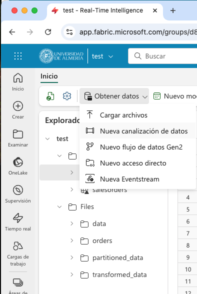
4. En el cuadro de diálogo `Nueva canalización` introducir un nombre para el pipeline, por ejemplo, `pipeline-cargar-datos-ventas` y pulsar `Crear`. Aparecerá un asistente para la creación del pipeline.
5. En el primer paso del asistente elegiremos el origen de los datos. En nuestro caso vamos a descargar los datos de una URL, que es donde se encuentran los datos de ventas. Para ello, introducir HTTP en el cuadro de búsqueda y seleccionar la actividad `Http`.
+
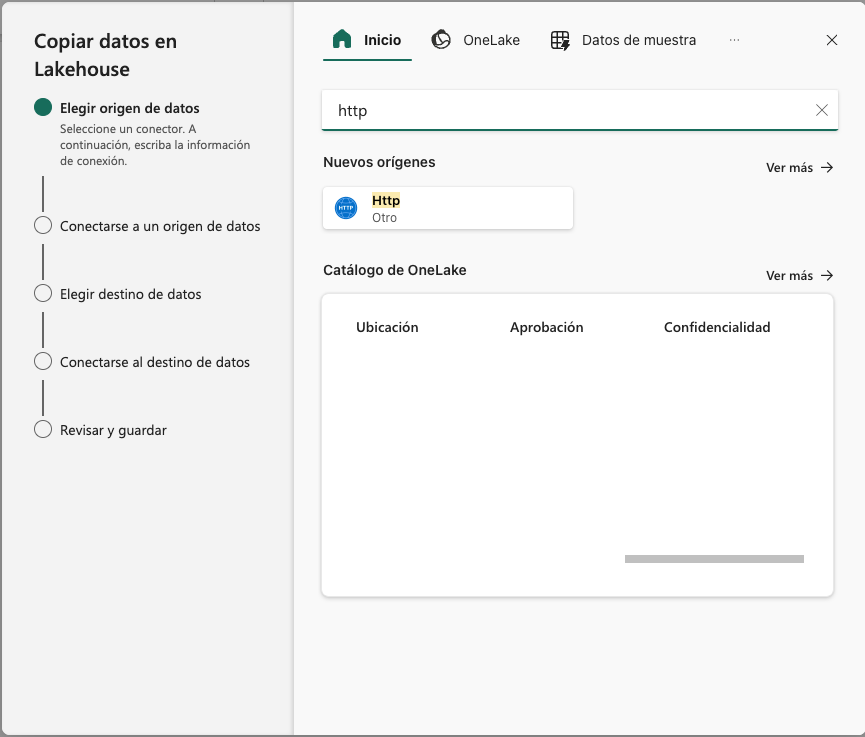
6. A continuación hay que indicar la configuración de la conexión a la URL. Usaremos estos datos:
    * Dirección URL: https://raw.githubusercontent.com/MicrosoftLearning/dp-data/main/sales.csv
    * Conexión: Dejar `Creación de una conexión`.
    * Nombre de la conexión: Un nombre descriptivo, como `tutorial-etl-ventas`.
    * Puerta de enlace: Dejar a `ninguno`.
    * Tipo de autenticación: Dejar a `Anónima`.
+
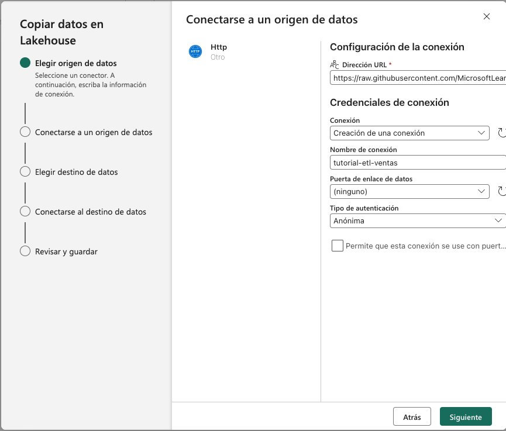
+
7. En el siguiente paso del asistente, se realizará la conexión al origen de datos indicado y se dejarán los valores por defecto en el que el método de recuperacuión de los datos es `GET`.
8. A continuación, se indicará el formato de los datos. En nuestro caso se trata de un archivo delimitado por comas y la primera fila contiene los nombres de las columnas. Se dejarán entonces los valores predeterminados. Opcionalmente, se podrá obtener una vista previa de los datos pulsando el botón `Vista previa de los datos`.
+
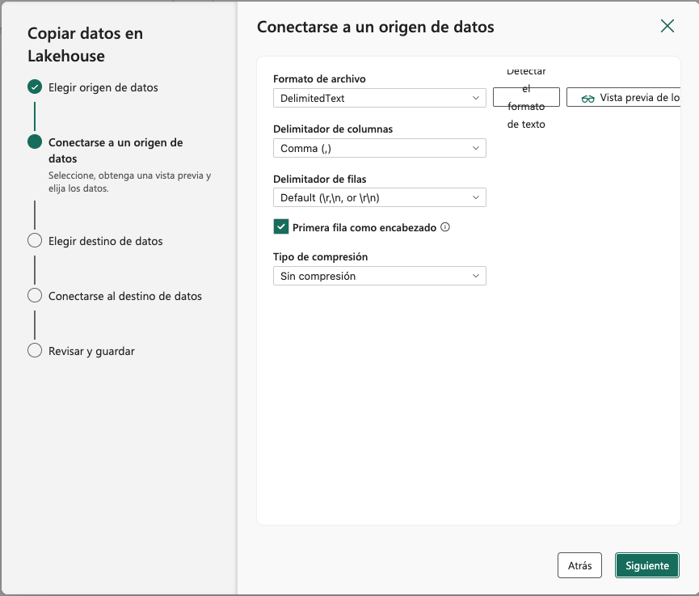
+
La figura siguiente muestra la vista previa de los datos obtenidos de la URL.
+
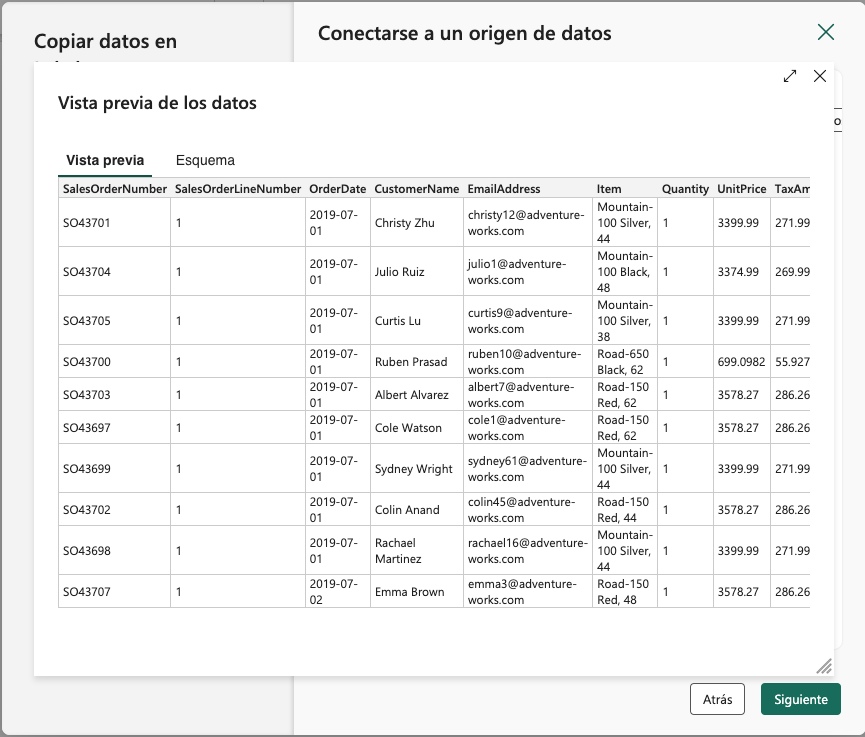
9. En el siguiente paso del asistente, se indicará el destino de los datos. En nuestro caso, vamos a almacenar los datos en un archivo e introduciremo lo siguiente en el asistente:
    * Seleccinar `Archivos` en la opción `Carpeta raíz`.
    * `Ruta de acceso de la carpeta`: `new_data`.
    * `Nombre de archivo`: `ventas.csv`.
+
La figura siguiente muestra la conexión al destino de los datos.
+
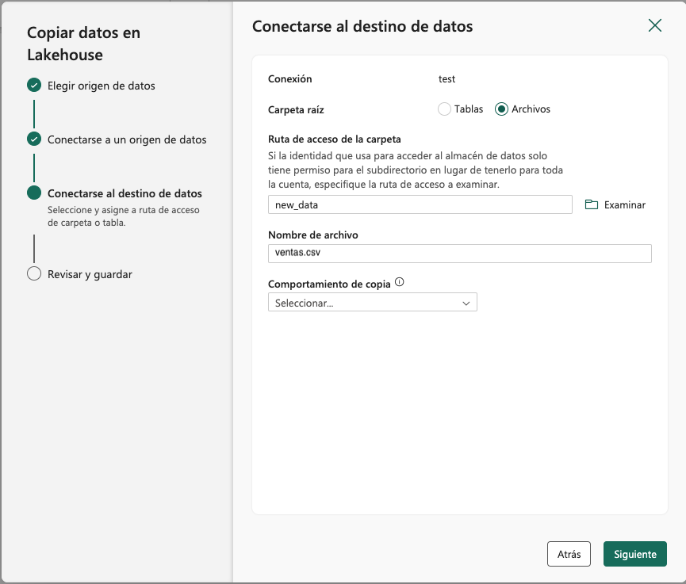
10. En el siguiente paso del asistente dejaremos los valores por defecto ya que no queremos realizar cambios en el archivo descargado y lo almacenaremos tal cual. Finalmente pulsaremos `Siguiente`.
11. En el último paso del asistente, se revisarán los valores introducidos y se pulsará `Guardar y ejecutar`. El pipeline entrará en ejecución y se mostrará el progreso en la interfaz de Fabric. Tras unos segundos, el pipeline finalizará y se mostrará el estado. La figura siguiente muestra el estado del pipeline tras la ejecución.
+
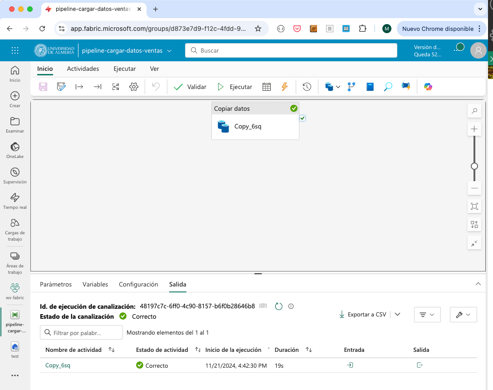

Tras finalizar la ejecución del pipeline, se habrán descargado los datos de ventas de la URL y se habrán almacenado en un archivo en la carpeta `new_data` del lakehouse. Si se actualiza la carpeta `Files` del explorador del lakehouse, se podrá ver el archivo `ventas.csv` con los datos descargados, tal como se muestra en la figura siguiente.

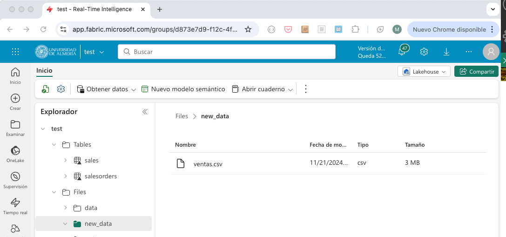

En el siguiente paso, veremos cómo procesar estos datos con un cuaderno de PySpark.

### Procesamiento de datos con PySpark

Normalmente, es necesaria realizar opereaciones de procesamiento sobre los datos antes de almacenarlos en un almacén de datos (p.e. operaciones de limpieza, transformación, etc.). Para ilustrarlo vamos a crear un cuaderno de PySpark en Fabric que procese los datos de ventas descargados de la URL. El procesamiento en este tutorial será algo sencillo, ya que sólo se quiere incidir en la mecánica y no en la técnica de tratamiento de datos con PySpark. Para ello, seguiremos los siguientes pasos:

1. Desde la página de inicio del lakehouse, seleccionar de la barra de herramientas `Abrir cuaderno | Nuevo cuaderno`.
+
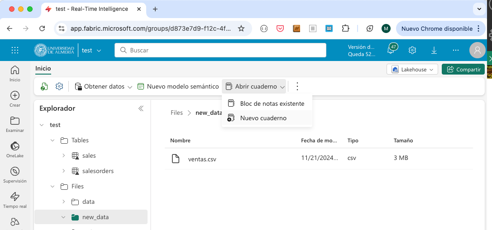
2. En el cuaderno recién creado, realizar las siguientes operaciones:
    a. Sustituir el código predeterminado de la celda por el siguiente código de PySpark:
+
[source,python]
----
table_name = "ventas"
----
    b. *En la barra de menú de la celda, seleccionar los puntos suspensivos y elegir `Toggle parameter cell`. Esto convertirá la celda en una celda de parámetros, lo que permitirá modificar el código de la celda en tiempo de ejecución.* La celda mostrará que es de tipo `Parameters` en la parte inferior derecha.
    c. Añadir una nueva celda de código y añadir el siguiente código de PySpark para procesar el archivo de ventas almacenado por el paso anterior, realizar algunos cambios en las columnas y guardar su resultado como una tabla en formato delta.
+
[source,python]
----
from pyspark.sql.functions import *

# Read the new sales data
df = spark.read.format("csv").option("header","true").load("Files/new_data/*.csv")

## Add month and year columns
df = df.withColumn("Year", year(col("OrderDate"))).withColumn("Month", month(col("OrderDate")))

# Derive FirstName and LastName columns
df = df.withColumn("FirstName", split(col("CustomerName"), " ").getItem(0)).withColumn("LastName", split(col("CustomerName"), " ").getItem(1))

# Filter and reorder columns
df = df["SalesOrderNumber", "SalesOrderLineNumber", "OrderDate", "Year", "Month", "FirstName", "LastName", "EmailAddress", "Item", "Quantity", "UnitPrice", "TaxAmount"]

# Derive subtotals <1>
df = df.withColumn("Subtotal", col("Quantity") * col("UnitPrice"))

# Change types <2>
df = df.withColumn("OrderDate", df["OrderDate"].cast("date")) \
                     .withColumn("Quantity", df["Quantity"].cast("int")) \
                     .withColumn("UnitPrice", df["UnitPrice"].cast("float"))

# Load the data into a table <3>
df.write.format("delta").mode("append").saveAsTable(table_name)
----
<1> Se añade una columna `Subtotal` que es el producto de la cantidad y el precio unitario.
<2> Se cambian los tipos de las columnas `OrderDate`, `Quantity` y `UnitPrice`. Si no, se tratarían como cadenas.
<3> Se guardar el resultado en una tabla en formato delta en modo de añadir datos.

    d. Guardar el cuaderno con el nombre `Cargar ventas` en el workspace.
3. Ejecutar el cuaderno pulsando el botón `Ejecutar todo` en la barra de herramientas. El cuaderno se ejecutará y se mostrará el progreso en la interfaz de Fabric. Tras unos segundos, el cuaderno finalizará y podremos encontrar la tabla `ventas` en el lakehouse con los datos procesados después de actualizar las tablas del explorador. La figura siguiente muestra la tabla `ventas` en el explorador del lakehouse.
+
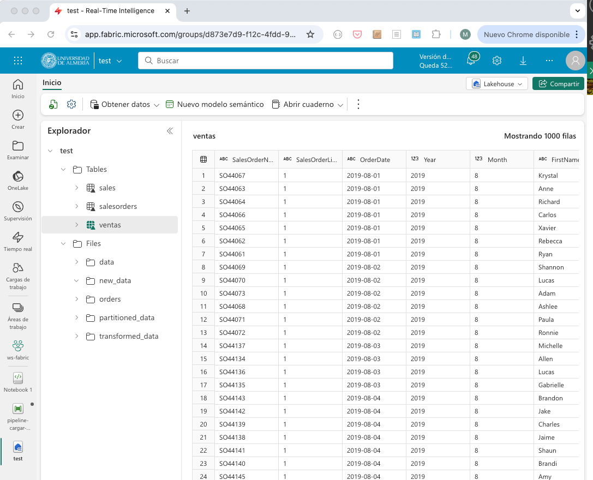
4. Volver al cuaderno y guardarlo con el nombre `Cargar ventas` en el workspace.

En este punto, hemos descargado los datos de ventas de una URL, los hemos almacenado en un archivo en el lakehouse y los hemos procesado con un cuaderno de PySpark. En el siguiente paso, veremos cómo modificar el pipeline para que ejecute el cuaderno de PySpark y siempre trabaje con los datos más recientes.

### Modificación del pipeline

Para modificar el pipeline y que ejecute el cuaderno de PySpark, seguiremos los siguientes pasos:

1. Abrir el pipeline desde la pantalla de inicio del lakehouse.
2. Añadir a la derecha de la actividad de copia de datos una nueva actividad de cuaderno. Las actividades se encuentran en la pestaña `Actividades`. Una de las primeras es `Cuaderno`. No obstante, los puntos suspensivos de la barra de herramientas muestran todas las actividades y permiten buscarlas. Seleccionar la actividad `Cuaderno` y configurar lo siguiente:
    * En la pestaña `General`, en `Nombre` introducir `Ejecutar Cargar ventas`. 
    * En la pestaña `Configuración`, seleccionar el cuaderno `Cargar ventas` que hemos creado en el paso anterior del workspace. Desplegar `Parámetros de la base`, pulsar el botón `Nuevo` y añadir un parámetro con el nombre `table_name`, tipo `Cadena` y el valor `nuevas_ventas`. **Esto permitirá que el cuaderno de PySpark use el nombre de la tabla `nuevas_ventas` en lugar de `ventas`. Por este motivo, definimos `table_name` como parámetro en el cuaderno de PySpark.**
3. Conectar la actividad de copia de datos con la actividad de cuaderno. Para ello, seleccionar la actividad de copia de datos y arrastrar la flecha que aparece en la parte inferior de la actividad (`Al finalizar`) hasta la actividad de cuaderno. La figura siguiente muestra la conexión entre las actividades.
+
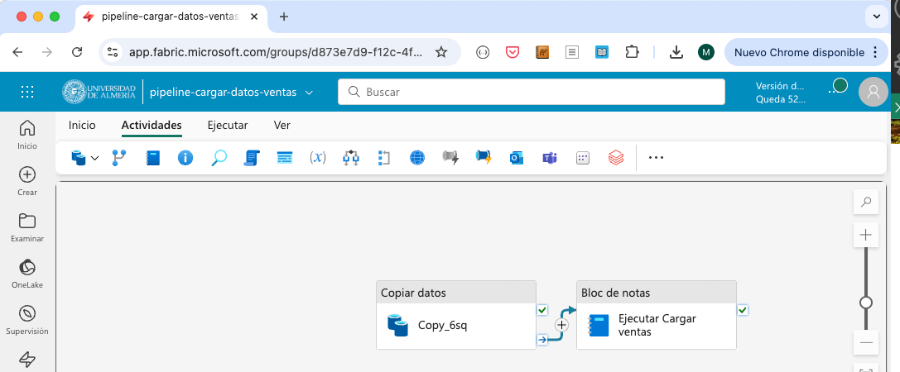
4. Modificar el nombre de la actividad de copia de datos a `Descargar datos de ventas`. Para ello, seleccionar la actividad de copia de datos y modificar el nombre en la pestaña `General`.
5. Añadir a la izquierda de la actividad de copia de datos una  actividad que se encargará de eliminar copias anteriores de los datos. Para ello, crear una nueva actividad `Eliminar datos` con la siguiente configuración:
    * En la pestaña `General`, en `Nombre` introducir `Eliminar datos antiguos`
    * En la pestaña `Origen` seleccionar el lakehouse `test`, seleccionar `Ruta de acceso del archivo de comodín`, en el directorio `new_data` y en `Nombre de archivo de archivo` introducir `*.csv`. Esto hará que se elimine cualquier archivo CSV en la carpeta `new_data`.
    * En la pestaña `Configuración de registro` se configura si se desea almacenar información de registro de la actividad en un archivo de log con los nombres de los archivos eliminados. En nuestro caso no es necesario y desactivaremos la opción `Habilitar el registro`.
6. Conectar la actividad de eliminación de datos con la actividad de copia de datos. Para ello, seleccionar la actividad de eliminación de datos y arrastrar la flecha que aparece en la parte inferior de la actividad (`Al finalizar`) hasta la actividad de copia de datos. La figura siguiente muestra la conexión final entre las actividades del pipeline.
+
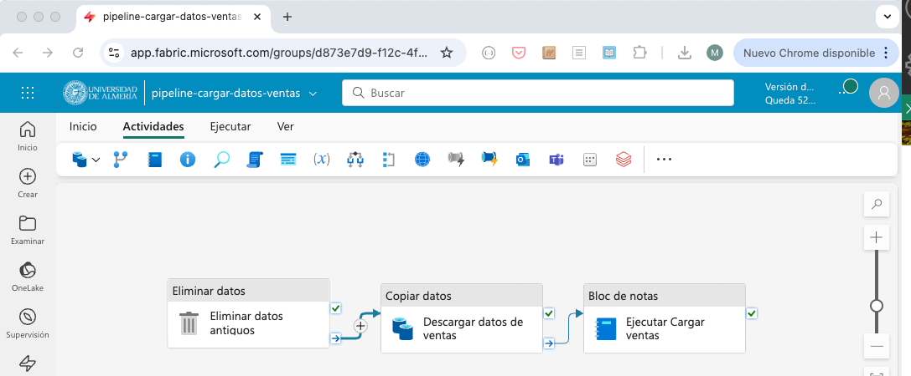

Tras realizar estos pasos, el pipeline estará listo para ejecutarse. 

### Ejecución del pipeline

Al ejecutar el pipeline, se eliminarán los datos antiguos, se descargarán los datos de ventas de la URL, se procesarán los datos con el cuaderno de PySpark y se almacenarán en la tabla `nuevas_ventas` en el lakehouse. El pipeline se puede ejecutar manualmente o programar su ejecución en un horario determinado. Para ejecutarlo manualmente, pulsar el botón `Ejecutar` de la barra de herramientas del menú `Ejecutar` del pipeline. Si se quiere programar la ejecución, pulsar el botón `Programación` y configurar el horario de ejecución y su frecuencia en caso de que se quiera ejecutar periódicamente. La figura siguiente muestra el pipeline junto con la salida de la ejecución de las tres actividades.

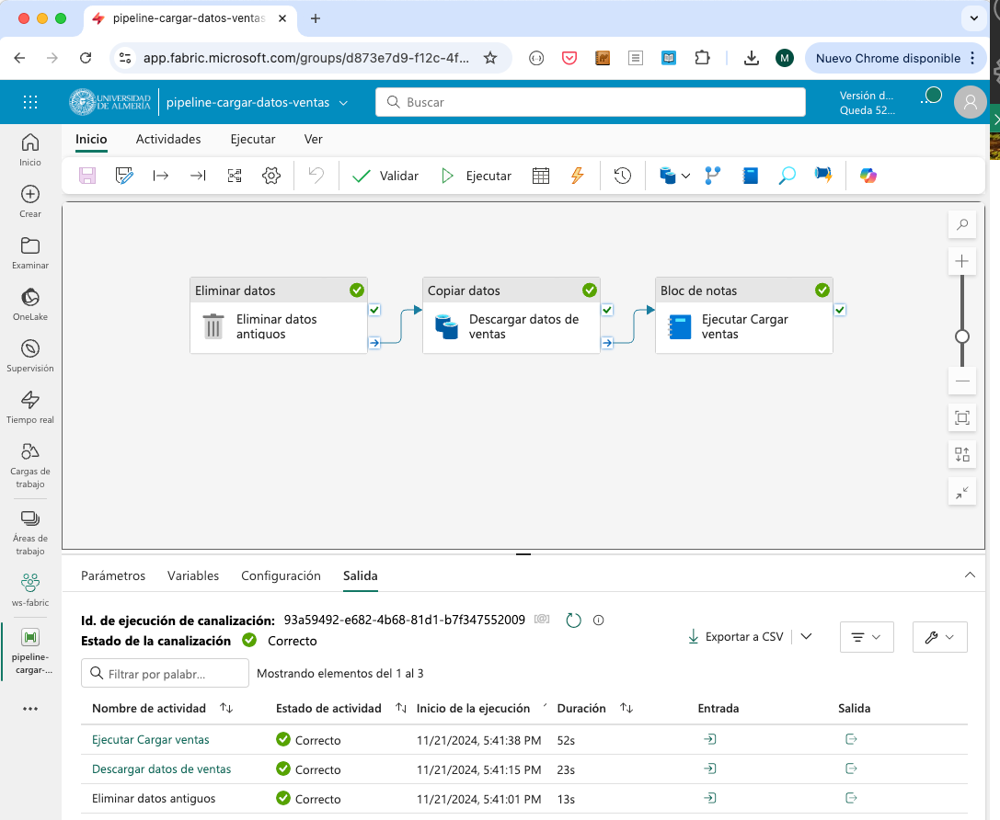

Tras finalizar la ejecución del pipeline, se podrá ver la tabla `nuevas_ventas` en el explorador del lakehouse con los datos procesados. La figura siguiente muestra la tabla `nuevas_ventas` en el explorador del lakehouse.

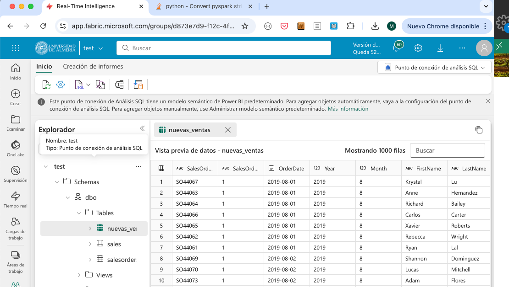

### Añadir la tabla creada al modelo semántico

Para que la tabla `nuevas_ventas` esté disponible en el modelo semántico, y esté disponible para realizar informes en Power BI, es necesario añadirla al modelo. Para ello, seguir los siguientes pasos:

1. Abrir el `Punto de conexión de análisis de SQL` desde la página de inicio del lakehouse (p.e. botón `Lakehouse | Punto de conexión SQL` en la barra de herramientas).
2. En la barra de herramientas, seleccionar `Creación de informes | Administrar modelo semántico predeterminado`.
3. Aparecerá un cuadro de diálogo para que seleccionemos la tabla que queremos añadir al modelo. Seleccionar la tabla `nuevas_ventas` y pulsar `Confirmar`. La figura siguiente muestra el cuadro de diálogo para añadir la tabla al modelo.
+
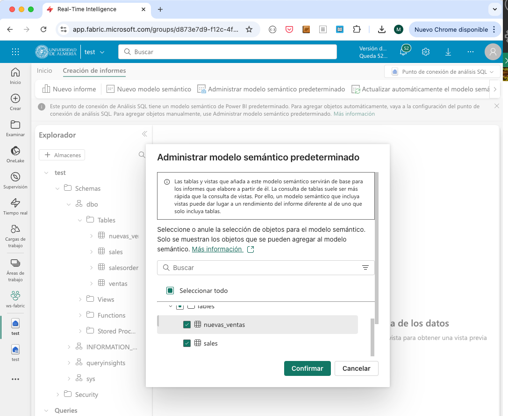

Tras añadir la tabla al modelo semántico, se podrá acceder a ella desde Power BI y realizar informes con los datos de ventas procesados.

La figura siguiente muestra un informe de Power BI con los datos de ventas procesados en la tabla `nuevas_ventas` realizados entre `1/7/2019` y `15/10/2019`. El informe incluye:

* Tres tarjetas de datos con el número de pedidos diferentes, el número de clientes diferentes y el número de productos diferentes.
* Un segmentador de fechas para filtrar los datos.
* Un gráfico de líneas con el total de ventas por pedido. Se ha creado una medida en Power BI para calcular el total de ventas por pedido a partir de la columna subtotal de cada pedido.
* Dos gráficos de barras con el total de ventas y unidades vendidas por producto.

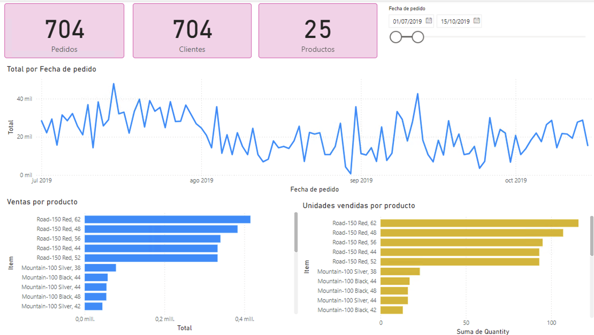

## Conclusiones

Los procesos ETL son fundamentales en la creación de almacenes de datos. Fabric ofrece una serie de componentes que permiten definir pipelines de datos de forma sencilla y sin necesidad de escribir código. En este laboratorio hemos visto cómo crear un pipeline en Fabric para la carga de datos de ventas, cómo procesar los datos con un cuaderno de PySpark y cómo añadir la tabla resultante al modelo semántico para realizar informes en Power BI. Fabric es una herramienta muy potente para la creación de pipelines de datos y permite definir flujos de trabajo complejos de forma sencilla.
