////
NO CAMBIAR!!
Codificación, idioma, tabla de contenidos, tipo de documento
////
:encoding: utf-8
:lang: es
:toc: right
:toc-title: Tabla de contenidos
:doctype: book
:linkattrs:
:icons: font


////
Nombre y título del trabajo
////
# Procesamiento de datos con Microsoft Fabric - Almacenes de datos
Grado en Ingeniería Informática. Universidad de Almería
Manuel Torres <mtorres@ual.es>


image::../../../images/di.png[]

// NO CAMBIAR!! (Entrar en modo no numerado de apartados)
:numbered!: 


[abstract]
== Resumen
////
COLOCA A CONTINUACION EL RESUMEN
////

Microsoft Fabric es una plataforma unificada de análisis de datos que facilita que los profesionales de datos trabajen juntos en proyectos de datos. Fabric favorece la desaparición de silos aislados de datos lo que mejora la colaboración entre profesionales de datos. Fabric proporciona un conjunto de servicios integrados que permiten ingerir, almacenar, procesar y analizar datos en un solo entorno. Fabric se basa en un lakehouse que combina la flexibilidad del almacenamiento en data lakes con la capacidad de consulta y análisis de almacenamiento de datos. Fabric usa Spark para el procesamiento de datos y permite la integración con Power BI para la creación de informes.

Este tutorial describe cómo tratar con lakehouses en Fabric, cómo transformar datos con Spark, presenta los modelos semánticos para Power BI y cómo visualizar datos con Power BI. A modo de introducción al uso de Spark para el tratamiento de datos, se realizarán algunos ejemplos sencillos con PySpark y Spark SQL.

////
COLOCA A CONTINUACION LOS OBJETIVOS
////
.Objetivos

* Conocer los conceptos clave de los lakehouses en Fabric.
* Aprender a transformar datos con Spark en Fabric.
* Conocer cómo crear modelos semánticos para Power BI en Fabric.
* Aprender a visualizar datos con Power BI en Fabric.
* Realizar ejemplos sencillos de tratamiento de datos con PySpark y Spark SQL.

[NOTE]
====
Disponible el link:./SalesReportFabric.ipynb[cuaderno Jupyter] con el código de ejemplo en PySpark y Spark SQL.
====

:numbered: 

## Introducción

Las soluciones de análisis de datos tradicionales estaban construidas sobre la base de un almacén de datos, en la que los datos se almancenan siguiendo un modelo multidimensional. Es habitual encontrar implementaciones ROLAP en la que los datos se almacenan en tablas relacionales siguiendo un esquema en estrella y son consultadas mediante SQL. pero con la aparición del fenómeno de _Big data_ o macrodatos, (caracterizados por las 3 V: volumen, velocidad y variedad) las organizaciones han tenido que adaptar sus soluciones de análisis de datos para poder procesar y analizar grandes volúmenes de datos de diferentes fuentes y formatos. Esto normalmente nos lleba a tecnologías de almacenamiento y procesamiento a escala cloud, lo que da pie a la aparición de soluciones de almacenamiento como Azure Data Lake y de procesamiento como Spark. En un data lake, los datos se almacenan en su formatoi natico, como archivos sin imponer un esquema fijo para su almacenamiento. Y esto puede ser llevado más allá con la aparición de los lakehouses, que combinan la flexibilidad de los data lakes (almacenando los datos en archivos en un data lake) con la capacidad de consulta y análisis de los almacenes de datos (se crea una capa de metadatos adicional ofreciendo un acceso mediante un esquema relacional que puede ser consultado en SQL)

.Las tres V de los macrodatos o del big data
****
Los macrodatos son conjuntos de datos que son tan grandes o complejos que no se pueden procesar con las herramientas de procesamiento de datos tradicionales. Los macrodatos se asocian a lo que se conoce como las 3 V: volumen, velocidad y variedad. A los macrodatos también se les conoce como big data.

* **Volumen**: Los macrodatos se caracterizan por tener un volumen de datos muy grande. Los datos se generan a una velocidad muy alta y provienen de una variedad de fuentes.
* **Velocidad**: Los macrodatos se generan a una velocidad muy alta. Los datos se generan en tiempo real y se deben procesar rápidamente.
* **Variedad**: Los macrodatos provienen de una variedad de fuentes y están en una variedad de formatos. Los datos pueden ser estructurados, semiestructurados o no estructurados.
****

## Conceptos clave

### Fabric

La plataforma unificada de análisis de datos de Microsoft Fabric facilita que los profesionales de datos trabajen juntos en proyectos de datos. Fabric quita los silos de datos y la necesidad de acceso a varios sistemas, lo que mejora la colaboración entre profesionales de datos. Así, podemos considerar que Fabric es una plataforma de colaboración de datos y que proporciona un conjunto de servicios integrados que permiten ingerir, almacenar, procesar y analizar datos en un solo entorno.

### Data Lakes

Un lago de datos es un repositorio de almacenamiento que contiene una gran cantidad de datos en bruto en su formato nativo. Los datos no se procesan ni se transforman antes de ser almacenados en el lago de datos. Los datos se almacenan en su formato nativo, lo que permite a los científicos de datos y a los analistas de datos acceder a los datos sin tener que preocuparse por la estructura de los datos.

### OneLake

OneLake es una arquitectura de Fabric centrada en lagos de datos que proporciona un único entorno integrado para que los profesionales de datos y la empresa puedan colaborar en proyectos de datos. Se puede considerar como OneDrive para datos. De forma similar a la que las aplicaciones de Office están preconfiguradas para usar OneDrive de la organización, todas las cargas de trabajo de proceso de Fabric están preconfiguradas para trabajar con OneLake. Los ingenieros de datos ahora pueden ingerir, transformar y cargar grandes cantidades de datos en OneLake y presentarlos en cualquier sistema de almacenamiento de datos que tenga más sentido. Los científicos de datos pueden acceder a los datos en OneLake y usarlos para crear modelos de aprendizaje automático y análisis avanzados.

### Lakehouse

Un lakehouse combina la flexibilidad del almacenamiento en data lakes con el análisis de almacenamiento de datos. Microsoft Fabric ofrece una solución de lakehouse para un análisis exhaustivo en una sola plataforma SaaS.

La base de Fabric es un lakehouse, creado sobre la capa de almacenamiento escalable de OneLake, y usa Spark y SQL para el procesamiento de datos. Un lakehouese es una plataforma unificada que combina:

* El almacenamiento flexible y escalable de un data lake.
* La capacidad de consulta y análisis de datos de un data warehouse.

Imaginemos un caso de una organización que ha estado usando data warehousing para almacenar datos estructurados de sus sistemas transaccionales, como el historial de pedidos, los niveles de inventario y la información de los clientes. También ha recopilado datos no estructurados de las redes sociales, registros de sitios web y orígenes de terceros que son difíciles de administrar y de analizar con la infraestructura de data warehousing existente. La nueva directiva de la empresa es mejorar la capacidad de toma de decisiones mediante el análisis de datos de varios orígenes y formatos de datos. Es decir, la organización necesita una plataforma de análisis de datos que pueda manejar datos estructurados y no estructurados. Para esto, se puede usar Fabric, que proporciona un lakehouse para un análisis exhaustivo en una sola plataforma SaaS.

image::../../../images/fabric-lakehouse.png[]

### Apache Spark

Apache Spark forma parte del ecosistema de big data de Apache y es un motor de análisis unificado para el procesamiento de datos a gran escala. Spark se integra en Fabric para proporcionar una plataforma de procesamiento de datos en un lakehouse. Spark se puede usar para procesar datos en tiempo real, realizar análisis de datos, realizar aprendizaje automático y realizar análisis de gráficos. Spark permite el uso de distintos lenguajes de programación, como Scala, Java, Python y SQL, para escribir programas de procesamiento de datos.

## Creación de un lakehouse

En este apartado veremos cómo crear un lakehouse en Fabric y cómo cargar datos en el lakehouse. Para ello, seguiremos los siguientes pasos:

Comenzaremos abriendo [Data Factory](https://app.fabric.microsoft.com/home?experience=data-factory) en Fabric. Data Factory es una herramienta de Fabric que permite crear y programar flujos de trabajo de datos. Data Factory se puede usar para ingerir, transformar y cargar datos en un lakehouse. Data Factory proporciona una interfaz gráfica para crear flujos de trabajo de datos y permite la integración con otros servicios de Fabric, como OneLake y Spark. Una vez abierta Data Factory, se mostrará la página de inicio de Fabric.

image::../../../images/fabric-welcome.png[]

A continuación, crearemos un espacio de trabajo nuevo (p.e. `ws-fabric`). Un espacio de trabajo es un contenedor lógico que se utiliza para organizar y administrar los recursos de Fabric, como los lakehouses, los grupos de Spark y los cuadernos de Spark. Para crear un espacio de trabajo, pulsaremos el botón `Nuevo espacio de trabajo` y seguiremos los pasos del asistente para crear un espacio de trabajo. La figura muestra la creación de un espacio de trabajo.

image::../../../images/fabric-create-workspace.png[]

Nos pedirá actualizar a una licencia de pago, pero también ofrece una versión de evaluación de 60 días. La elegiremos para poder seguir con el tutorial. La figura muestra la activación de la versión de evaluación.

image::../../../images/fabric-trial.png[]

[NOTE]
====
Si no se ha creado el espacio de trabajo correctamente mientras se ha activado la versión de evaluación, se puede volver a intentar creando un nuevo espacio de trabajo.
====

El espacio de trabajo se creará y se podrá empezar a trabajar con él, como se muestra en la figura.

image::../../../images/fabric-workspace.png[]

Para crear el lakehouse, desde el espacio de trabajo creado pulsar el botón `Nuevo elemento`. Aparecerá un menú de varias opciones organizadas por categorías (Obtener datos, Almacenar datos, Preparación de datos, ...). Seleccionar la opción `Lakehouse` en la categoría  `Almacenar datos`.

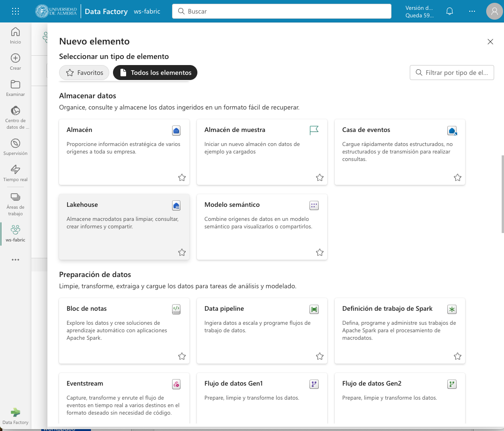

Aparecerá un cuadro de diálogo para introducir un nombre para el lakehouse. Introducir un nombre (p.e. `test`) y pulsar el botón `Crear`. Se creará el lakehouse y se podrá empezar a trabajar con él.

image::../../../images/fabric-lakehouse-created.png[]

La parte izquierda muestra un explorador para examinar las tablas y archivos del lakehouse. Las tablas se podrán consultar en SQL. Los archivos estarán almacenados en OneLake. Crear una carpeta `data` en la carpeta `Files` y subir un archivo [sales.csv](https://raw.githubusercontent.com/MicrosoftLearning/dp-data/main/sales.csv) con datos de ejemplo.


$$$$$$$$Este archivo sería procesable con Spark. Ver cómo hacerlo**********


Una vez cargado el archivo en el lakehouse, lo cargaremos en una tabla. Para ello, elegiremos la opción desde el menú que aparece en los puntos suspensivos de la tabla `sales.csv` y seleccionaremos la opción `Cargar en tablas -> Nueva tabla`. Nos pedirá un nombre para la tabla y que indiquemos el separador de campos del archivo CSV. Introducir un nombre (p.e. `sales`), mantener la coma como separador y pulsar el botón `Cargar`.

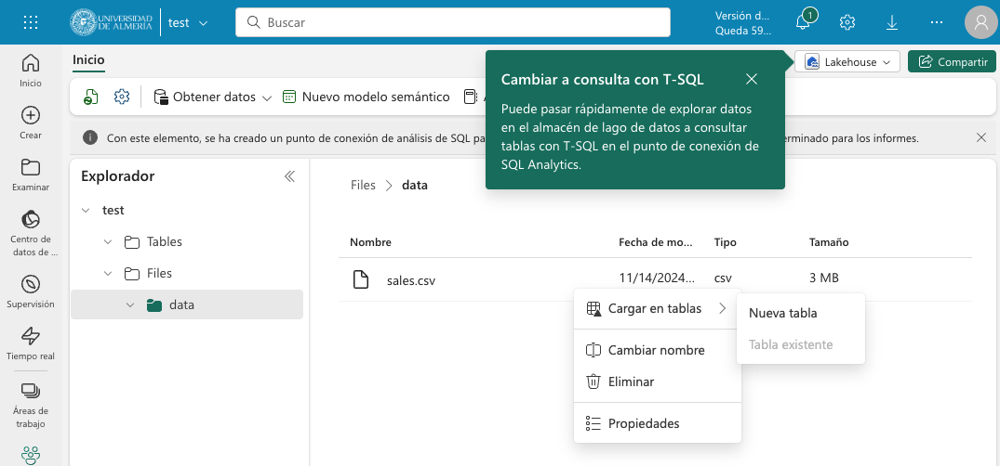

La tabla `sales` se creará correctamente, se almacenará en formato `Parquet` y se mostrarán los campos creados en la tabla. Al seleccionarla se podrá ver el contenido de la tabla.

image::../../../images/fabric-table-created.png[]

### Consulta de la tabla con SQL

Para consultar la tabla con SQL, cambiar del modo Explorador al modo SQL en el botón de la parte superior derecha. Se podrá escribir una consulta SQL para consultar la tabla `sales`. A modo de ejemplo, como la tabla `sales` tiene un campo `Item` que contiene el nombre del producto, y campos `Quantity` y `UnitPrice` que contienen la cantidad vendida y el precio del producto, se puede escribir una consulta SQL para calcular el total de ventas por producto. El resultado lo mostraremos ordenado de mayor a menor por el total de ventas.

```sql
SELECT Item, SUM(Quantity * UnitPrice) AS SalesByItem
FROM sales
GROUP BY Item
ORDER BY SalesByItem DESC;
```

La figura muestra el resultado de la consulta SQL.

image::../../../images/fabric-sql-query.png[]

### Creación de una vista

Las vistas permiten personalizar la forma en que se ven los datos en el lakehouse. En nuestro caso crearemos una vista a partir de la tabla `sales` que añada una columna con el subtotal por fila. Para crear la vista, basta con seleccionar la opción `Crear vista` desde el menú de puntos suspensivos del explorador del lakehouse. Se abrirá un editor para escribir la consulta SQL que define la vista. A modo de ejemplo, la consulta SQL para crear la vista sería la siguiente:

```sql
CREATE VIEW [dbo].[salesWithSubtotals]
AS SELECT *, Quantity * UnitPrice AS Subtotal
FROM [sales]
```

La vista `salesWithSubtotals` se creará correctamente y se podrá consultar en el explorador del lakehouse.

### Administrar el modelo semántico predeterminado

El modelo semántico predeterminado es un modelo de datos que se crea automáticamente cuando se carga un archivo en un lakehouse. El modelo semántico predeterminado se crea a partir de los metadatos del archivo y se puede personalizar para satisfacer las necesidades de análisis de datos. Inicialmente, no contiene nada. Comenzaremos por añadirle la tabla `sales` y la vista que hemos creado anteriormente. Para ello, en la pestaña `Creación de informes` selecionamos `Administrar modelo semántico predeterminado`. Aparecerá un cuadro de diálogo para que podamos añadir los objetos deseados. En nuestro caso añadiremos la tabla `sales`, la vista `salesWithSubtotals` y pulsaremos el botón `Confirmar`.

image::../../../images/fabric-add-table.png[]

La tabla y la vista se añadirán al modelo semántico predeterminado. Una vez añadidos los objetos, se podrán utilizar en la creación de informes con Power BI.

### Creación de un informe con Power BI

Desde el lakehouse se puede crear un informe con Power BI. Para ello, seleccionar la pestaña `Creación de informes` de la parte superior y pulsar el botón `Nuevo informe`. 

[NOTE]
====
Si no se ha añadido nada al modelo semántico predeterminado, aparecerá un mensaje indicando que no hay objetos en el modelo semántico. En este caso, añadir la tabla `sales` y la vista `salesWithSubtotals` al modelo semántico predeterminado.
====

A modo de ilustración, crearemos un informe de ventas con Power BI sobre la vista `salesWithSubtotals` que muestre lo siguiente:

* Tres tarjetas de datos en la parte superior para: total de ventas (`Subtotal`), clientes diferentes y productos diferentes.
* Un gráfico de barras que muestre el total de ventas (`Subtotal`) por producto.
* Dos gráficos de líneas que muestren las ventas (`Subtotal`) y unidades vendidas (`Quantity`) por fecha.

La figura muestra el informe de ventas creado con Power BI. Guardaremos el informe con el nombre de `sales-report`.

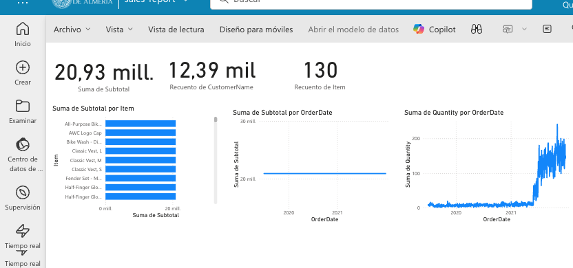

## Análisis y transformación de datos con Spark

Apache Spark es un motor de análisis unificado y distribuido para el procesamiento de datos a gran escala. Al ser distribuido, el procesamiento es realizado en varios nodos de lo que se conoce como un clúster de Spark. Ese cluster en conocido en Fabric como _grupo de Spark_. En ese enfoque de procesamiento distribuido, unos nodos denominados _nodos de trabajo_ se encargan de realizar las tareas de procesamiento de datos y otros nodos denominados _nodos principales se encargan de coordinar las tareas de los nodos de trabajo.
En este apartado veremos cómo usar Spark para ingerir, procesar y analizar datos en un lakehouse de Fabric. La figura siguiente muestra un ejemplo de un grupo de Spark en Fabric con un nodo principal (1) y cuatro nodos de trabajo (2).

image::../../../images/fabric-spark-cluster.png[]

En Fabric, cada workspace es inicializado con un grupo de Spark. En la configuración del workspace se puede configurar un grupo Spark existente o crear nuevos grupos Spark. La opción está disponible en el menú `Ciencia/Ingeniería de datos` en la configuración del workspace. La figura siguiente muestra la configuración del grupo Spark de inicio creado de forma predeterminada en el workspace. El grupo se puede modificar para cambiar las características hardware de los nodos de trabajo, el escalado automático, el número de nodos de trabajo y si se van a asignar recursos dinámicamente a los trabajos de Spark.

image::../../../images/fabric-spark-group.png[]

A partir del workspace y el lakehouse creados anteriormente, en este apartado vamos a desarrollar un ejemplo de procesamiento de datos con Spark. 

### Preparación del trabajo

Para llevar a cabo el ejemplo necesitaremos una serie de datos con los que trabajar y un cuaderno de Spark. A continuación realizaremos la carga de datos en el lakehouse, la creación de un cuaderno de Spark y la carga de los datos.

#### Carga de datos en el lakehouse

Descargaremos en nuestro equipo este [archivo .zip de ventas](https://github.com/MicrosoftLearning/dp-data/raw/main/orders.zip) y lo subiremos a una carpeta `orders` del lakehouse. El archivo contiene datos de ventas en formato CSV de los años 2019, 2020 y 2021. La figura siguiente muestra los tres archivos en la carpeta `orders` del exploradore del lakehouse.

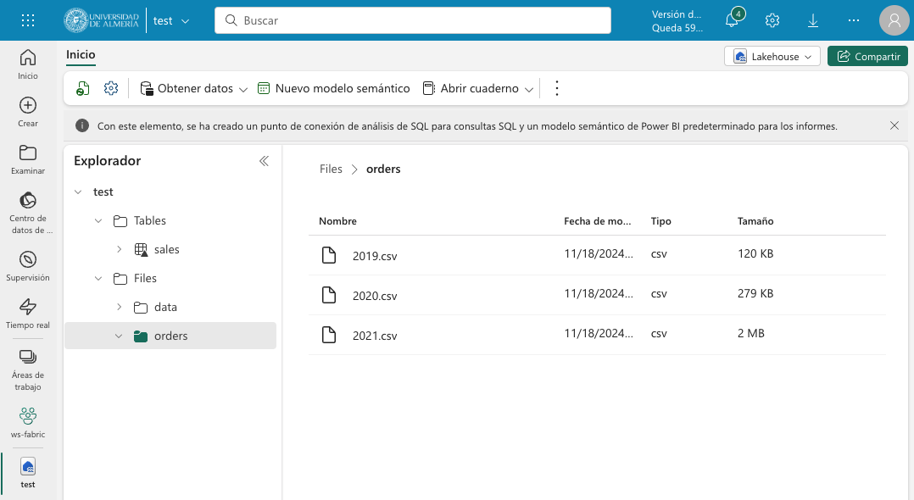

#### Creación de un cuaderno de Spark

Un cuaderno de Spark es un entorno interactivo que permite escribir y ejecutar código de Spark en diferentes lenguajes y permite añadir notas para explicaciones y comentarios. Para crear el cuaderno en Facric, desde el explorador del lakehouse y teniendo seleccionada la carpeta `orders` seleccionaremos de la barra de herramientas `Abrir cuaderno | Nuevo cuaderno`. Aparecerá un cuaderno de Spark con una celda en blanco en el que podremos escribir y ejecutar código de Spark.

[NOTE]
====
Los cuadernos están formados por celdas. Cada celda puede contener código, texto o gráficos. El código puede escribirse en diferentes lenguajes, como Scala, Python, SQL o R. El texto puede escribirse en Markdown. Las celdas se pueden ejecutar de forma independiente.
====

En un primer paso convertiremos la celda en una celda de Markdown (pulsando el botón  `M↓` de la barra de herramientas de la celda) y le introduciremos este texto:

```markdown
# Exploración de datos de pedidos

Utilizar el código de este cuaderno para explorar los datos de pedidos y realizar un análisis exploratorio de los datos.
```

Podremos cambiar entre la vista de edición de la celda y la de visualización. La figura siguiente muestra la celda de Markdown en la vista de visualización.

image::../../../images/fabric-markdown-cell.png[]

### Carga de datos en un DataFrame de Spark

Un _Dataframe_ es una estructura de datos tabular que se puede utilizar para representar datos en Spark. En el cuaderno de Spark, crearemos una nueva celda situando el ratón debajo de la celda Markdown creada en el paso anterior. En la nueva celda escribiremos el siguiente código en PySpark para cargar los datos de ventas en un DataFrame de Spark:

[NOTE]
====
PySpark es una variante de Spark que permite escribir código en Python para procesar datos en Spark. Es uno de los lenguajes más utilizados en Spark y es el predeterminado en Fabric.
====

[source,python]
----
df = spark.read.format("csv").option("header","true").load("Files/orders/2019.csv") <1>
# df now is a Spark DataFrame containing CSV data from "Files/orders/2019.csv".
display(df) <2>
----
<1> Carga los datos del archivo CSV "2019.csv" en un DataFrame de Spark. Los datos se presentan con cabecera
<2> Muestra los datos en una tabla


Para ejecutar el código, pulsaremos el botón de `Ejecutar` de la celda. El código cargará los datos del archivo `2019.csv` en un DataFrame de Spark y mostrará los datos en una tabla. La figura siguiente muestra los datos de ventas cargados en un DataFrame de Spark.

image::../../../images/fabric-spark-dataframe.png[]

Como los datos que se muestran en la cabecera no son válidos, retiraremos la cabecera y crearemos un esquema para los datos de ventas. Modificaremos el código de la celda para que quede de la siguiente forma:

[source,python]
----
from pyspark.sql.types import *

orderSchema = StructType([
    StructField("SalesOrderNumber", StringType()),
    StructField("SalesOrderLineNumber", IntegerType()),
    StructField("OrderDate", DateType()),
    StructField("CustomerName", StringType()),
    StructField("Email", StringType()),
    StructField("Item", StringType()),
    StructField("Quantity", IntegerType()),
    StructField("UnitPrice", FloatType()),
    StructField("Tax", FloatType())
    ]) <1>

df = spark.read.format("csv").schema(orderSchema).load("Files/orders/2019.csv") <2>
display(df)
----
<1> Define un esquema para los datos de ventas
<2> Carga los datos del archivo CSV "2019.csv" en un DataFrame de Spark con el esquema definido

Al volver a ejecutar la celda, tras unos instantes se mostrará el dataframe con los datos de ventas con la cabecera correcta. La figura siguiente muestra los datos de ventas cargados en un DataFrame de Spark con el esquema correcto.

image::../../../images/fabric-spark-dataframe-schema.png[]

El ejemplo anterior sólo cargaba en el dataframe los datos de pedidos de 2019. Para cargar los datos de todos los años basta con modificar el código de la celda para que cargue todos los archivos de la carpeta `orders`. El código quedaría de la siguiente forma:

[source,python]
----
from pyspark.sql.types import *

orderSchema = StructType([
    StructField("SalesOrderNumber", StringType()),
    StructField("SalesOrderLineNumber", IntegerType()),
    StructField("OrderDate", DateType()),
    StructField("CustomerName", StringType()),
    StructField("Email", StringType()),
    StructField("Item", StringType()),
    StructField("Quantity", IntegerType()),
    StructField("UnitPrice", FloatType()),
    StructField("Tax", FloatType())
    ])

df = spark.read.format("csv").schema(orderSchema).load("Files/orders/*.csv") <1>
display(df)
----
<1> Carga los datos de todos los archivos CSV de la carpeta "Files/orders" en un DataFrame de Spark con el esquema definido.

Al ejecutar la celda, se mostrarán los datos de ventas de todos los años en un DataFrame de Spark. 

### Exploración de datos

Los objetos dataframe ofrecen una serie de métodos para explorar y analizar los datos. A continuuación veremos algunos ejemplos de cómo explorar los datos de ventas con Spark.

Añadiremos una nueva celda al cuaderno de Spark y escribiremos el siguiente código para seleccionar sólo las columnas `CustomeName` y `Email` y usar algunos operadores de agregación para contar filas y valores únicos:

El ejemplo siguiente muestra el código para seleccionar sólo las columnas `CustomerName` y `Email` y contar el número total de filas y el número de filas únicas:

[source,python]
----
customers = df.select("CustomerName", "Email") <1>

print(customers.count())
print(customers.distinct().count())
display(customers.distinct())
----
<1> `customers` es un nuevo DataFrame que contiene sólo las columnas `CustomerName` y `Email`.

Los filtros los aplicaremos mediante el método `where`. El ejemplo siguiente muestra el código modificado para seleccionar sólo los pedidos que incluyen un tipo de elemento específico. Los datos se muestran en una tabla.

[source,python]
----
customers = df.select("CustomerName", "Email").where(df['Item']=='Road-250 Red, 52')
print("Total de clientes" + customers.count())
print("Total de clientes diferentes" + customers.distinct().count())
display(customers.distinct())
----

El ejemplo siguiente muestra el código para calcular el total de ventas por producto y mostrar los resultados en una tabla. El ejemplo agrupa por la columna `Item` y luego aplica la función de agregación `sum` a todas las columnas numéricas para calcular el total de ventas por producto.

[source,python]
----
productSales = df.select("Item", "Quantity").groupBy("Item").sum()
display(productSales)
----

El ejemplo siguiente muestra el código para calcular las ventas anuales y mostrar los resultados en una tabla. El ejemplo agrupa por la columna `OrderDate` y luego aplica la función de agregación `sum` a todas las columnas numéricas para calcular las ventas anuales presentando los datos ordenados por año.

[source,python]
----
from pyspark.sql.functions import * <1>

yearlySales = df.select(year("OrderDate").alias("Year")).groupBy("Year").count().orderBy("Year") <2>
display(yearlySales)
----
<1> Importa las funciones de Spark SQL para trabajar con fechas. 
<2> La función `year` extrae el año de una fecha.

### Transformación de datos

A la hora de tratar con datos es muy habitual tener que realizar transformaciones sobre ellos. En Spark, las transformaciones se realizan mediante la función `withColumn` que permite añadir una nueva columna al DataFrame o modificar una columna existente. A continuación veremos algunos ejemplos de cómo realizar transformaciones sobre los datos de ventas con Spark.

El ejemplo siguiente muestra el código para realizar varias transformaciones sobre el dataframe de ventas. En primer lugar, se añade una nueva columna `TotalPrice` al DataFrame que contiene el precio total de cada pedido. La nueva columna se calcula multiplicando las columnas `Quantity` y `UnitPrice`. En segundo lugar, se crean nuevas columnas `Year` y `Month` a partir de la columna `OrderDate` que muestren el año y el mes de cada pedido. En tercer lugar, se crean nuevas columnas `FirstName` y `LastName` a partir de la columna `CustomerName` que muestren el nombre y el apellido de cada cliente. Por último, se seleccionan sólo las columnas necesarias para el análisis.

[source,python]
----
# Añadir una nueva columna TotalPrice al DataFrame que contiene el precio total de cada pedido
transformed_df = df.withColumn("TotalPrice", df["Quantity"] * df["UnitPrice"])

# Crear nuevas columnas Year y Month a partir de la columna OrderDate que muestren el año y el mes de cada pedido
transformed_df = transformed_df.withColumn("Year", year(col("OrderDate"))).withColumn("Month", month(col("OrderDate")))

# Crear nuevas columnas FirstName y LastName a partir de la columna CustomerName que muestren el nombre y el apellido de cada cliente
transformed_df = transformed_df.withColumn("FirstName", split(col("CustomerName"), " ").getItem(0)).withColumn("LastName", split(col("CustomerName"), " ").getItem(1))

# Seleccionar sólo las columnas necesarias para el análisis
transformed_df = transformed_df["SalesOrderNumber", "SalesOrderLineNumber", "OrderDate", "Year", "Month", "FirstName", "LastName", "Email", "Item", "Quantity", "UnitPrice", "Tax", "TotalPrice"]

# Mostrar las primeras 10 filas del DataFrame transformado
display(transformed_df.limit(10))
----

### Guardar los datos transformados

Una vez realizadas las transformaciones necesarias sobre los datos, es posible guardar los datos transformados en un nuevo archivo. En entornos de procesamiento de datos suele ser habitual utilizar otros formatos de datos más eficientes que el CSV, como el formato [Parquet](https://parquet.apache.org/). El formato Parquet es un formato de archivo de almacenamiento de columnas que es muy eficiente para el análisis de datos y es compatible con Spark. A continuación veremos cómo guardar los datos transformados en un archivo Parquet.

El ejemplo siguiente muestra el código para guardar los datos transformados en un archivo Parquet. Para una mejor organización de los archivos, usaremos una carpeta `transformed_data` en el lakehouse para almacenar los datos transformados. El código guarda los datos transformados en una carpeta Parquet llamada `orders`. La carpeta Parquet contendrá varios archivos Parquet que contienen los datos transformados. La figura siguiente muestre los datos transformados guardados en Parquet tras actualizar el explorador del datalake.

[source,python]
----
transformed_df.write.mode("overwrite").parquet('Files/transformed_data/orders')
print ("Datos transformados guardados en Parquet")
----

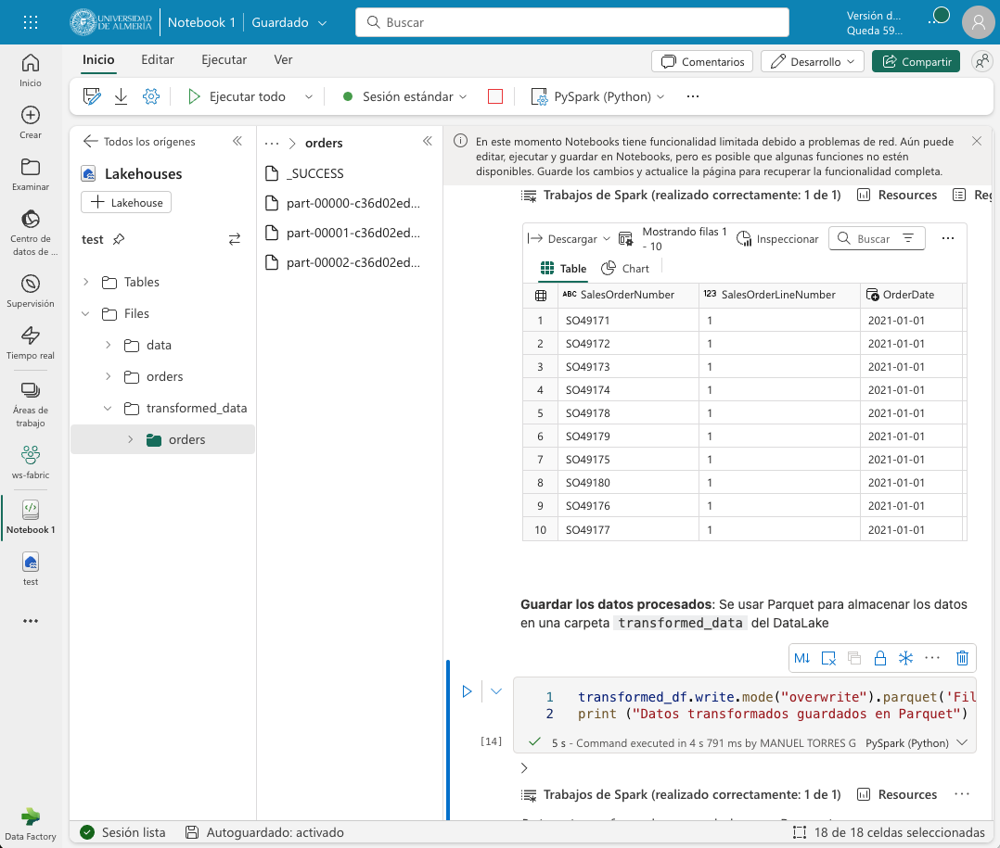

A la hora de guardar datos transformados es habitual crear particiones en los datos para mejorar el rendimiento de las consultas. Las particiones dividen los datos en subconjuntos más pequeños que se almacenan en carpetas separadas. En Spark, las particiones se pueden crear mediante el método `partitionBy` que permite particionar los datos por una o varias columnas. A continuación veremos cómo guardar los datos transformados en un archivo Parquet particionado por año y mes.

El ejemplo siguiente muestra el código para guardar los datos transformados en un archivo Parquet particionado por año y mes. El código guarda los datos transformados en una carpeta Parquet llamada `partitioned_data/orders`. La carpeta Parquet contendrá varias carpetas Parquet que contienen los datos transformados particionados por año y mes. La figura siguiente muestre los datos transformados guardados en Parquet particionado tras actualizar el explorador del datalake.

[source,python]
----
transformed_df.write.mode("overwrite").partitionBy("Year", "Month").parquet('Files/partitioned_data/orders')
print ("Datos transformados guardados en Parquet particionado")
----

image::../../../images/fabric-partitioned-data.png[]

Una vez particionados los datos, se pueden consultar de forma más eficiente. Por ejemplo, si queremos consultar los datos de ventas de un año y un mes concretos, Spark sólo tendrá que leer los archivos Parquet correspondientes a esa partición. El ejemplo siguiente muestra el código para cargar los datos de ventas de 2019 en un DataFrame de Spark.

[source,python]
----
orders_2019_df = spark.read.format("parquet").load("Files/partitioned_data/Year=2019/Month=*")
display(orders_2019_df)
----

La imagen siguiente muestra los datos de ventas de 2019 cargados en un DataFrame de Spark.

image::../../../images/fabric-partitioned-data-2019.png[]

### Uso de SQL en Spark

Spark SQL es un módulo de Spark que permite ejecutar consultas SQL sobre los datos de Spark. Spark SQL permite trabajar con datos estructurados y semiestructurados y ofrece una serie de funciones y operadores para trabajar con los datos. A continuación veremos cómo utilizar Spark SQL para realizar consultas sobre los datos de ventas.

Para utilizar Spark SQL en un cuaderno de Spark, usaremos lo que se conoce como _metastore_ de Spark. El metastore permite definir tablas relacionales sobre los datos de Spark y ejecutar consultas SQL sobre esas tablas. De esta manera se combina la flexibilidad de almacenamiento en data lakes con la capacidad de consulta y análisis de almacenamiento de datos. A continuación veremos cómo definir una tabla sobre los datos de ventas y ejecutar consultas SQL sobre esa tabla.

Comenzaremos guardando los datos del dataframe de ventas en una tabla denominada `salesorders`. Mediante `DESCRIBE` podemos obtener la estructura de la tabla. A continuación mostramos cómo ejecutar una consulta SQL sobre la tabla `salesorders` para calcular el total de ventas por producto y mostrar los resultados en una tabla.

[source,python]
----
# Guardar los datos del DataFrame de ventas en una tabla denominada salesorders
df.write.format("delta").saveAsTable("salesorders")

# Mostrar la estructura de la tabla salesorders
spark.sql("DESCRIBE salesorders").show()
----

La figura siguiente muestra la estructura de la tabla `salesorders` tras ejecutar la consulta SQL. Tras actualizar el explorador del lakehouse se observa que `salesorders` es una tabla Delta.

[NOTE]
====
Delta es un formato de archivo de almacenamiento de datos que es muy eficiente para el análisis de datos y es compatible con Spark. Delta proporciona una serie de características adicionales, como la capacidad de realizar operaciones de escritura atómicas, la capacidad de realizar operaciones de escritura de datos en tiempo real y la capacidad de realizar operaciones de escritura de datos en tiempo real.
====

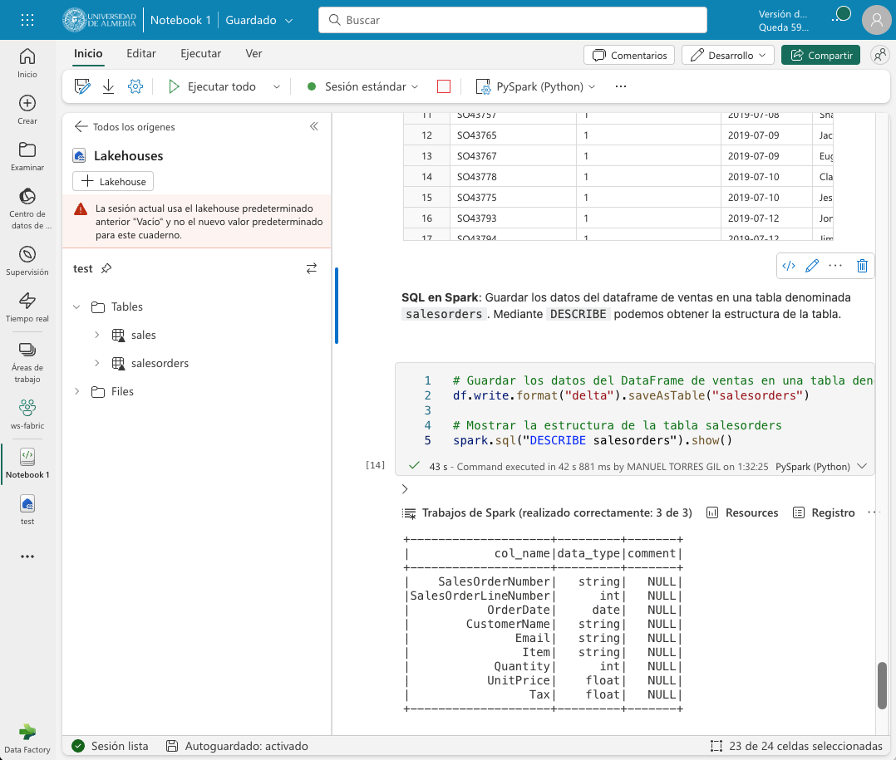

Tras crear la tabla `salesorders` en el metastore de Spark, podemos ejecutar consultas SQL sobre los datos de ventas. El ejemplo siguiente muestra el código para ejecutar una consulta SQL sobre la tabla `salesorders` para calcular el total de ventas por año incluyendo impuestos y mostrar los resultados en una tabla ordenados por año. La figura siguiente muestra los resultados de la consulta SQL. 

[source,sql]
----
%%sql <1>
SELECT YEAR(OrderDate) AS OrderYear,
       SUM((UnitPrice * Quantity) + Tax) AS GrossRevenue
FROM salesorders
GROUP BY YEAR(OrderDate)
ORDER BY OrderYear;
----
<1> La celda se ejecuta como una consulta SQL. A esta línea se la denomina _comando mágico_.

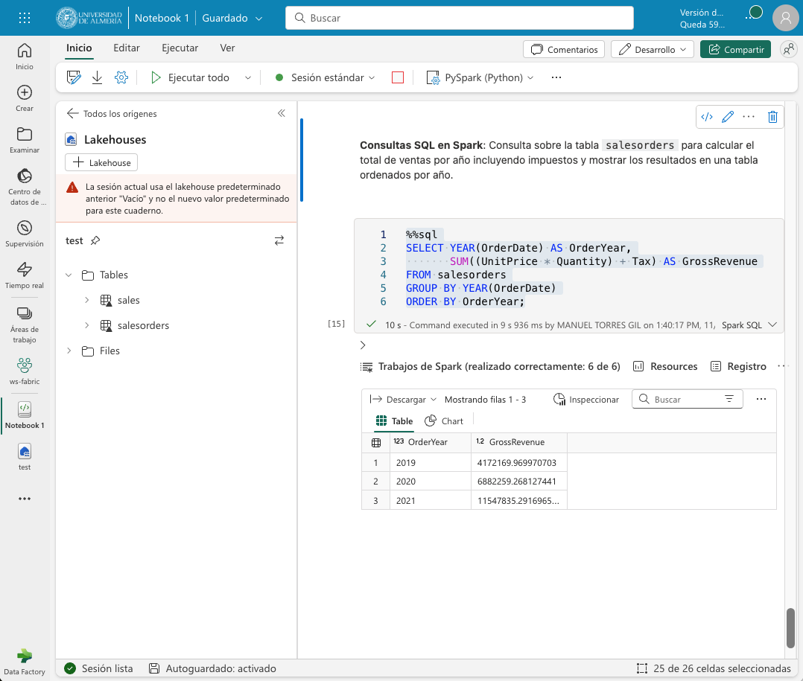

### Visualización de datos con Spark

De forma predeterminada, la ejecución de una consulta SQL o de un comando que muestre un dataframe puede ser visualizado como un gráfico en Fabric. Para ello, basta con pulsar sobre la pestaña `Chart` de la salida de la celda. La figura siguiente muestra el gráfico de barras que muestra el total de ventas por año incluyendo impuestos. Además, se puede observar que también es posible personalizar el gráfico pulsando sobre `Personalizar gráfico`.

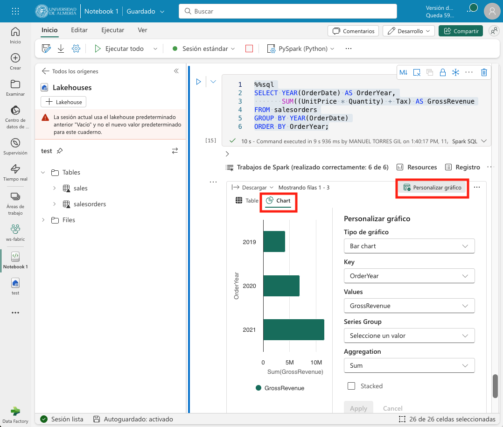

## Creación de un informe con Power BI

Una vez que hemos explorado y transformado los datos de ventas con Spark, podemos crear un informe con Power BI para visualizar los datos de ventas. El informe lo podemos realizar sobre la tabla o la vista que creamos mediante la importación de un archivo CSV, o sobre la tabla `salesorders` que creamos mediante Spark SQL a partir de un dataframe de Spark. De una forma o de otra, el origen de datos será el lakehouse de Fabric y será transparente para Power BI. Eso sí, para que Power BI puede acceder a los datos transformados, primero deberemos añadirlos al modelo semántico predeterminado. Si no están añadididos, desde el explorador del lakehouse seleccionaremos la opción `Administrar modelo semántico predeterminado` en la pestaña `Creación de informes`. Aparecerá un cuadro de diálogo para que podamos añadir los objetos deseados. En nuestro caso añadiremos la tabla `salesorders` y pulsaremos el botón `Confirmar`. La figura siguiente muestra cómo añadir la tabla `salesorders` al modelo semántico predeterminado.

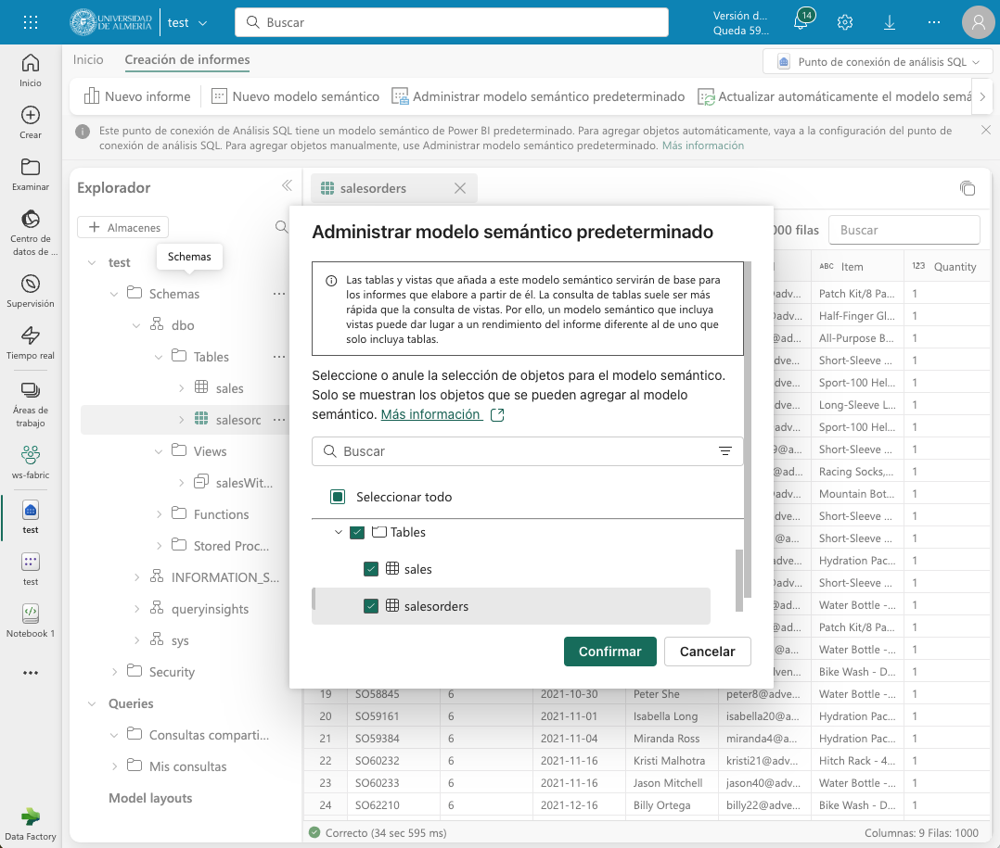

Tras añadir la tabla `salesorders` al modelo semántico predeterminado, podremos crear un informe con Power BI sobre los datos de ventas que tienen su origen en un dataframe Spark. Para ello, seleccionaremos la pestaña `Creación de informes` de la parte superior y pulsaremos el botón `Nuevo informe`. Para seleccionar la fuente de datos podremos hacerlo de cualquier de estas dos formas:

* Seleccionando `Obtener datos | Microsoft Fabric | Modelo semántico de Power BI`.
* Seleccionando `Centro de datos de OneLake| Modelo semántico de Power BI`.

La figura siguiente ilustra el cuadro de diálogo para obtener datos desde un modelo semántico de Power BI.

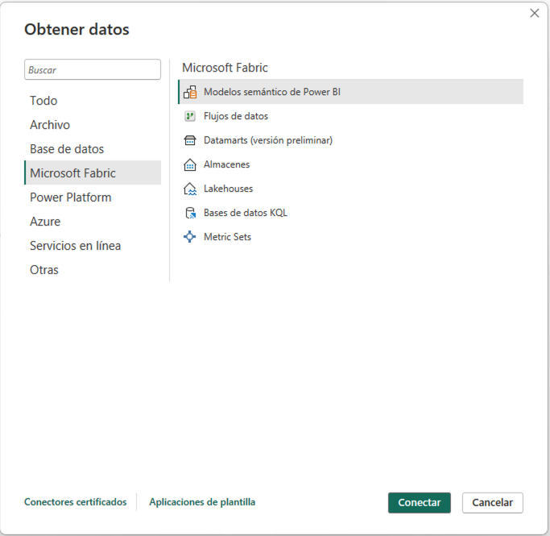

A continuación aparecerá un cuadro de diálogo con las distintas fuentes de datos a las que podemos acceder. Entre ellas estará el lakehouse `test` creado en Fabric tal y como se muestra en la figura siguiente. Seleccionaremos el lakehouse y pulsaremos el botón `Conectar`. Esto hará que aparezcan en la zona `Datos` de Power BI las tablas y vistas disponibles en el lakehouse.

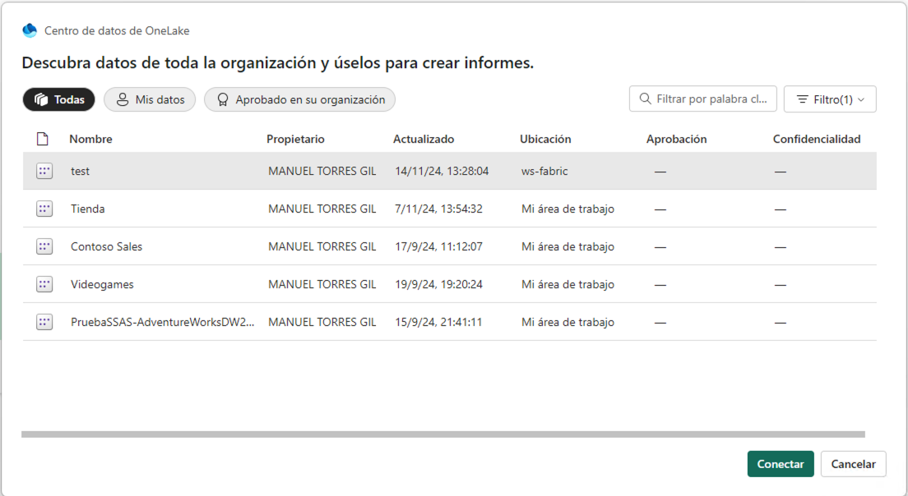

A partir de aquí, podremos crear un informe con Power BI sobre los datos de ventas. A modo de ilustración, crearemos un informe de ventas con Power BI sobre la tabla `salesorders` que muestre lo siguiente:

* Dos tarjetas de datos apiladas en la parte izquierda para: total de clientes diferentes y total de productos diferentes.
* Dos gráficos de líneas que muestren la suma de unidades vendidas (`Quantity`) e impuestos (`Tax`) por fecha.

La figura siguiente muestra el informe de ventas creado con Power BI. En el informe se han cambiado los títulos y los ejes de los gráficos para que muestren valores más adecuados en lugar de los generados directamente a partir de los campos de la fuente de datos. Guardaremos el informe con el nombre de `salesorders-report`.

image::../../../images/fabric-powerbi-report-salesorders.png[]

## Conclusiones

En este tutorial hemos trabajado con Fabric para realizar un ejemplo descriptivo de operaciones habituales en un entorno de procesamiento de datos. Entre las tareas hemos creado un lakehouse, hemos cargado datos, hemos creado un cuaderno Spark para realizar operaciones básicas de tratamiento de datos, hemos practicado con archivos Parquet. Finalmente, dado que Fabric permite la integración con Power BI a través de un modelo semántico, hemos definido el modelo semántico y hemos creado un informe con Power BI.